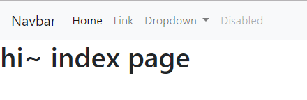

***

복습 가볍게~

```cmd
student@M1504 MINGW64 ~/Documents/GitHub/STUDY/Python (master)
$ cd Framword\(Django\)/

student@M1504 MINGW64 ~/Documents/GitHub/STUDY/Python/Framword(Django) (master)
$ ls
django_ex  django_intro  venv

student@M1504 MINGW64 ~/Documents/GitHub/STUDY/Python/Framword(Django) (master)
$ mkdir django_orm

student@M1504 MINGW64 ~/Documents/GitHub/STUDY/Python/Framword(Django) (master)
$ ls
django_ex  django_intro  django_orm  venv

student@M1504 MINGW64 ~/Documents/GitHub/STUDY/Python/Framword(Django) (master)
$ source venv/Scripts/activate
#가상환경 진입!
student@M1504 MINGW64 ~/Documents/GitHub/STUDY/Python/Framword(Django) (master)
$ pip list
Package         Version  
--------------- ---------
certifi         2019.9.11
chardet         3.0.4
Django          2.2.7    
Faker           2.0.3
idna            2.8
pip             19.3.1
python-dateutil 2.8.1
pytz            2019.3
requests        2.22.0
setuptools      41.6.0
six             1.13.0
sqlparse        0.3.0
text-unidecode  1.3
urllib3         1.25.7
wheel           0.33.6
(venv) 
#장고 설치 확인!
student@M1504 MINGW64 ~/Documents/GitHub/STUDY/Python/Framword(Django) (master)
$ cd django_orm/
(venv) 
#작업 폴더로 이동!
student@M1504 MINGW64 ~/Documents/GitHub/STUDY/Python/Framword(Django)/django_orm (master)
$ ls
(venv) 
student@M1504 MINGW64 ~/Documents/GitHub/STUDY/Python/Framword(Django)/django_orm (master)
$ django-admin startproject config .
(venv) 
#장고 프로젝트 시작 설정 파일 설정! 

```

```python
#settings.py 파일 설정!


# Internationalization
# https://docs.djangoproject.com/en/2.2/topics/i18n/

LANGUAGE_CODE = 'ko-kr'

TIME_ZONE = 'Asia/Seoul'
```


## 앱 생성

```cmd
student@M1504 MINGW64 ~/Documents/GitHub/STUDY/Python/Framword(Django)/django_orm (master)
$ python manage.py startapp boards
(venv) 
```

```python
#settings.py 에 만든 앱 추가

# Application definition

INSTALLED_APPS = [
    'boards',
    'django.contrib.admin',
    'django.contrib.auth',
    'django.contrib.contenttypes',
    'django.contrib.sessions',
    'django.contrib.messages',
    'django.contrib.staticfiles',
]
```


#### 앱  urls 설정

```python 
#config(프로젝트 설정 파일의 urls.py)

from django.contrib import admin
from django.urls import path , include
#include를 추가하여 urls 연결 !

urlpatterns = [
    path('board/', include('boards.urls')),
    path('admin/', admin.site.urls),
    
]

```

- 이제 boards app폴더에 urls.py 파일 생성!

```python
#boards의 ulrs.py

from django.urls import path
from . import views
#현재 파일의 views를 읽겠다.
urlpatterns = [
    path('' , views.index),
]
#기본 페이지 index로 설정하자.
```

```python 
#board 의 views

from django.shortcuts import render

# Create your views here.
def index(request):
    return render (request, 'boards/index.html')
```

#### 앱  tempates 설정

- boards 폴더 아래 templates 만들고 그안에 boards파일을 만들어 index.html 을 넣어 준다! 
- 전체적으로 사용할 templates또한 만들어 주자~
- html에 templates상속을 위해서 셋팅이 필요!

```python
#설정파일 config 의 settings.py


TEMPLATES = [
    {
        'BACKEND': 'django.template.backends.django.DjangoTemplates',
        'DIRS': [os.path.join(BASE_DIR , "config" , "templates")],
        'APP_DIRS': True,
        'OPTIONS': {
            'context_processors': [
                'django.template.context_processors.debug',
                'django.template.context_processors.request',
                'django.contrib.auth.context_processors.auth',
                'django.contrib.messages.context_processors.messages',
            ],
        },
    },
]
```

- BASE_DIR만들 준비 완료!
- config폴더에 templates 폴더 생성!(공통적으로 사용할 html이 들어간다.)

```html
<!DOCTYPE html>
<html lang="en">
<head>
    
        <link rel="stylesheet" href="https://stackpath.bootstrapcdn.com/bootstrap/4.3.1/css/bootstrap.min.css" integrity="sha384-ggOyR0iXCbMQv3Xipma34MD+dH/1fQ784/j6cY/iJTQUOhcWr7x9JvoRxT2MZw1T" crossorigin="anonymous">
    <meta charset="UTF-8">
    <meta name="viewport" content="width=device-width, initial-scale=1.0">
    <meta http-equiv="X-UA-Compatible" content="ie=edge">
    <title>Document</title>
</head>
<body>
        <nav class="navbar navbar-expand-lg navbar-light bg-light">
                <a class="navbar-brand" href="#">Navbar</a>
                <button class="navbar-toggler" type="button" data-toggle="collapse" data-target="#navbarSupportedContent" aria-controls="navbarSupportedContent" aria-expanded="false" aria-label="Toggle navigation">
                  <span class="navbar-toggler-icon"></span>
                </button>
              
                <div class="collapse navbar-collapse" id="navbarSupportedContent">
                  <ul class="navbar-nav mr-auto">
                    <li class="nav-item active">
                      <a class="nav-link" href="#">Home <span class="sr-only">(current)</span></a>
                    </li>
                    <li class="nav-item">
                      <a class="nav-link" href="#">Link</a>
                    </li>
                    <li class="nav-item dropdown">
                      <a class="nav-link dropdown-toggle" href="#" id="navbarDropdown" role="button" data-toggle="dropdown" aria-haspopup="true" aria-expanded="false">
                        Dropdown
                      </a>
                      <div class="dropdown-menu" aria-labelledby="navbarDropdown">
                        <a class="dropdown-item" href="#">Action</a>
                        <a class="dropdown-item" href="#">Another action</a>
                        <div class="dropdown-divider"></div>
                        <a class="dropdown-item" href="#">Something else here</a>
                      </div>
                    </li>
                    <li class="nav-item">
                      <a class="nav-link disabled" href="#" tabindex="-1" aria-disabled="true">Disabled</a>
                    </li>
                  </ul>
                  <form class="form-inline my-2 my-lg-0">
                    <input class="form-control mr-sm-2" type="search" placeholder="Search" aria-label="Search">
                    <button class="btn btn-outline-success my-2 my-sm-0" type="submit">Search</button>
                  </form>
                </div>
              </nav>
    
    
    


        <script src="https://code.jquery.com/jquery-3.3.1.slim.min.js" integrity="sha384-q8i/X+965DzO0rT7abK41JStQIAqVgRVzpbzo5smXKp4YfRvH+8abtTE1Pi6jizo" crossorigin="anonymous"></script>
        <script src="https://cdnjs.cloudflare.com/ajax/libs/popper.js/1.14.7/umd/popper.min.js" integrity="sha384-UO2eT0CpHqdSJQ6hJty5KVphtPhzWj9WO1clHTMGa3JDZwrnQq4sF86dIHNDz0W1" crossorigin="anonymous"></script>
        <script src="https://stackpath.bootstrapcdn.com/bootstrap/4.3.1/js/bootstrap.min.js" integrity="sha384-JjSmVgyd0p3pXB1rRibZUAYoIIy6OrQ6VrjIEaFf/nJGzIxFDsf4x0xIM+B07jRM" crossorigin="anonymous"></script>
</body>
</html>
```

```python
#boards>index.html



<h1>hi~ index page</h1>

```



***

# ORM(Object Relational Mapping)

- MTV패턴에서 model 부분이다.
- MTV(MVC)(모델/템플릿(뷰)/뷰(컨트롤러))

## 데이터베이스 기본 구조

#### Query란?

- 쿼리를 날린다! 라고도 한다.
- 데이터를 질의, 조회하는 명령어
- 데이터베이스의 요청(쿼리)을 해서 받는 것이 쿼리 세트이다.

#### Database란?

- 이러한 데이터의 모임이 데이터베이스!
- 체계화된 데이터의 모임이라고 한다.

#### SKIMA? 스키마란?

- DB자료의 구조
- 어떻게 그 DB를 표현할지!
- 어떻게  관계를 표현할지!

#### Table?

- 필드 : 컬럼
- 레코드 :  데이터

## ORM?

- 파이썬은 객체지향이며, 데이터 베이스를 이용하기 위해 장고에서 사용하는 것
- flask에서는 Pytest? 쓴다.

#### 장점

- sql을 몰라도 DB접근 가능하며 쉽게 사용 가능
- 클래스의 인스턴스를 생성하는 방법으로 ORM을 다루는데, sql이 길면 해석하는데 시간이 걸리는데, ORM의 경우 코드의 가독성이 좋다. 
- 객체지향으로 접근 가능해서 생상성이 좋아진다.
- mapping정보가 확실해서 ERD 보는것의 의존도가 낮아진다.(?)
- ORM은 독립적으로 작성되어 있고, 해당객체들을 재활용 할 수 있다. 그렇기에 모델에서 가공된 데이터를 컨트롤러(views.py)에 의해 뷰(templates)와 합쳐지는 형태로 디자인 패턴을 견고하게 다지는데 유리
- 객체 재생산성이 좋기떄문에 MVC패턴을 좀더 견고하게 만들어 준다.
- 별도 mysql설치해도 , 원래는 query 문이 조금씩 다른데, ORM이 기본적으로 설치되어 있어 이 부분에서 완화된다. 


#### 단점

- 모든것을 ORM으로 구현하기 힘들다
- 설계시 신중해야한다.
- 큰 프로젝트의 경우 난이도가 올라간다. 잘못 구현되면 속도 저하가 생길 수 있다.

#### 실습

```cmd
student@M1504 MINGW64 ~/Documents/GitHub/STUDY/Python/Framword(Django)/django_orm (master)
$ python manage.py shell
# 파이썬 쉘을 실행해 준다.
```

```cmd
>>> class Person : 
...     name = "사람의 고유한 이름"
...     age = "출생 이후로 부터 삶을 마감할 때까지의 기간"
...     def greeting(self):
...             print(f'{self.name}이 인사합니다.')
...     def eating(self):
...             print(f'{self.name}이 밥을 먹고 있습니다.')
...     def aging(self):
...             print(f'{self.name}은 현재 {self.age}살이지만  점점 나이를 더 먹겠죠.' 
... )
#enter두번 치면 나와진다.

>>> justin = Person() 
>>> print(justin.name)
사람의 고유한 이름
>>> print(justin.age)
출생 이후로 부터 삶을 마감할 때까지의 기간
>>> justin.age=19
>>> print(justin.age)
19
>>> print(Person.name)
사람의 고유한 이름

>>> print(Person.age)
출생 이후로 부터 삶을 마감할 때까지의 기간
>>> justin.greeting()
사람의 고유한 이름이 인사합니다.
>>> justin.name = justin
>>> justin.name = "수능보는 justin"
>>> justin.greeting
<bound method Person.greeting of <Person object at 0x000001E41C463B48>>
>>> justin.greeting()
수능보는 justin이 인사합니다.
>>> justin.aging()
수능보는 justin은 현재 19살이지만  점점 나이를 더 먹겠죠.
>>> exit() # 종료! 
```


## Model?

- 모델은 단일 데이터에 대한 정보를 가지고 있다.
- 필수적인 필드(컬럼)과 데이터(레코드)에 대한 정보를 포함
- 각각의 모델은 단일 데이터베이스 테이블과 매핑
- 사용자가 저장하는 데이터들의 필수적인 필드(컬럼) 동작을 포함
- 옵션을 줄 수있는데
  - `필드옵션` : 필드마다 고유 옵션이 존재, 공통 적용 옵션도 있음
  - null (DB 옵션) : DB 필드에 NULL 허용 여부 (디폴트 : False)
  - unique (DB 옵션) : 유일성 여부 (디폴트 : False)
  - blank : 입력값 유효성 (validation) 검사 시에 empty 값 허용 여부 (디폴트 : False)
  - default : 디폴트 값 지정. 값이 지정되지 않았을 때 사용
  - verbose_name : 필드 레이블. 지정되지 않으면 필드명이 쓰여짐
  - validators : 입력값 유효성 검사를 수행할 함수를 다수 지정
    - 각 필드마다 고유한 validators 들이 이미 등록되어있기도 함
    - 예 : 이메일만 받기, 최대길이 제한, 최소길이 제한, 최대값 제한, 최소값 제한 등
  - choices (form widget 용) : select box 소스로 사용
  - help_text (form widget 용) : 필드 입력 도움말
  - auto_now_add : Bool, True 인 경우, 레코드 생성시 현재 시간으로 자동 저장

#### 실습

```python
#boards의 models.py
from django.db import models

# Create your models here.
class Board(models.Model):
    title = models.CharField(max_length=10) #CharField는최대 글자를 설정해 주어야 한다.
    content = models.TextField() #Text Field는 maxlength주어도 DB에서 글자수 제한이 주어지지 않는다.
    created_at = models.DateTimeField(auto_now_add=True) #글이 생성되면 날짜가 자동으로 저장되기 위해서 auto_now_add
    #장고는 아이디를 자동으로 만들어주기 때문에 컬럼명만 신경 쓰면 된다! 
```

```cmd
student@M1504 MINGW64 ~/Documents/GitHub/STUDY/Python/Framword(Django)/django_orm (master)
$ python manage.py makemigrations
Migrations for 'boards':
  boards\migrations\0001_initial.py
    - Create model Board
(venv) 
#작성한 모델을 기본으로 만든다!
#새로고침해서 보면 migrations폴더가 생성되어있다 1
```

```python
#자동으로 만들어진 파일로 id 가 주어진 것을 확인 가능!
#생성된 파일이름은 0001_initial.py
# Generated by Django 2.2.7 on 2019-11-14 01:47

from django.db import migrations, models


class Migration(migrations.Migration):

    initial = True

    dependencies = [
    ]

    operations = [
        migrations.CreateModel(
            name='Board',
            fields=[
                ('id', models.AutoField(auto_created=True, primary_key=True, serialize=False, verbose_name='ID')),
                ('title', models.CharField(max_length=10)),
                ('content', models.TextField()),
                ('created_at', models.DateTimeField(auto_now_add=True)),
            ],
        ),
    ]

```

- 추가도가능하다~

```python
from django.db import models

# Create your models here.
class Board(models.Model):
    title = models.CharField(max_length=10) #CharField는최대 글자를 설정해 주어야 한다.
    content = models.TextField() #Text Field는 maxlength주어도 DB에서 글자수 제한이 주어지지 않는다.
    created_at = models.DateTimeField(auto_now_add=True) #글이 생성되면 날짜가 자동으로 저장되기 위해서 auto_now_add
    updated_at = models.DateTImeField(auto_now=True) #수정될때마다 시간 자동으로 저장하기 위해서
    
    
    
    #장고는 아이디를 자동으로 만들어주기 때문에 컬럼명만 신경 쓰면 된다! VO생성 안해도 된다
```

```cmd
student@M1504 MINGW64 ~/Documents/GitHub/STUDY/Python/Framword(Django)/django_orm (master)
$ python manage.py makemigrations
Migrations for 'boards':
  boards\migrations\0002_board_updated_at.py
    - Add field updated_at to board
(venv) 
#migrations만든다!
```

```python
#0002_board_updated_at.py
#새로 파일 생성!!!

# Generated by Django 2.2.7 on 2019-11-14 02:07

from django.db import migrations, models


class Migration(migrations.Migration):

    dependencies = [
        ('boards', '0001_initial'),
    ]

    operations = [
        migrations.AddField(
            model_name='board',
            name='updated_at',
            field=models.DateTimeField(auto_now=True),
        ),
    ]

```

- query 확인을 위해

```cmd
student@M1504 MINGW64 ~/Documents/GitHub/STUDY/Python/Framword(Django)/django_orm (master)
$ python manage.py sqlmigrate boards 0001
#앱 이름과 번호를 작성해 준다.
BEGIN;
--
-- Create model Board
--
CREATE TABLE "boards_board" ("id" integer NOT NULL PRIMARY KEY AUTOINCREMENT, "title" varchar(10) NOT NULL, "content" text NOT NULL, 
"created_at" datetime NOT NULL);
COMMIT;
(venv) 

#자동으로 not null옵션이 들어간 것을 확인 가능!

```

- 아직 DB가 생성되지않은 명세서뿐이다.
- DB적용 유무 확인 가능!

```cmd
student@M1504 MINGW64 ~/Documents/GitHub/STUDY/Python/Framword(Django)/django_orm (master)
$ python manage.py showmigrations
admin
 [ ] 0001_initial
 [ ] 0002_logentry_remove_auto_add
 [ ] 0003_logentry_add_action_flag_choices
auth
 [ ] 0001_initial
 [ ] 0002_alter_permission_name_max_length
 [ ] 0003_alter_user_email_max_length
 [ ] 0004_alter_user_username_opts
 [ ] 0005_alter_user_last_login_null
 [ ] 0006_require_contenttypes_0002
 [ ] 0007_alter_validators_add_error_messages
 [ ] 0008_alter_user_username_max_length
 [ ] 0009_alter_user_last_name_max_length
 [ ] 0010_alter_group_name_max_length
 [ ] 0011_update_proxy_permissions
boards
 [ ] 0001_initial
 [ ] 0002_board_updated_at
 #두가지가 준비된것을 확인 가능! 빈칸은 아직 DB가 적용되지 않았음을 확인 할 수 있다.
contenttypes
 [ ] 0001_initial
 [ ] 0002_remove_content_type_name
sessions
 [ ] 0001_initial
(venv) 
```

## DB 적용

`python manage.py migrate`

```cmd
student@M1504 MINGW64 ~/Documents/GitHub/STUDY/Python/Framword(Django)/django_orm (master)
$ python manage.py migrate
Operations to perform:
  Apply all migrations: admin, auth, boards, contenttypes, sessions
Running migrations:
  Applying contenttypes.0001_initial... OK
  Applying auth.0001_initial... OK
  Applying admin.0001_initial... OK
  Applying admin.0002_logentry_remove_auto_add... OK
  Applying admin.0003_logentry_add_action_flag_choices... OK
  Applying contenttypes.0002_remove_content_type_name... OK
  Applying auth.0002_alter_permission_name_max_length... OK
  Applying auth.0003_alter_user_email_max_length... OK
  Applying auth.0004_alter_user_username_opts... OK
  Applying auth.0005_alter_user_last_login_null... OK
  Applying auth.0006_require_contenttypes_0002... OK
  Applying auth.0007_alter_validators_add_error_messages... OK
  Applying auth.0008_alter_user_username_max_length... OK
  Applying auth.0009_alter_user_last_name_max_length... OK
  Applying auth.0010_alter_group_name_max_length... OK
  Applying auth.0011_update_proxy_permissions... OK
  Applying boards.0001_initial... OK
  Applying boards.0002_board_updated_at... OK
  Applying sessions.0001_initial... OK
(venv) 

# 적용 상태 확인!
student@M1504 MINGW64 ~/Documents/GitHub/STUDY/Python/Framword(Django)/django_orm (master)
$ python manage.py showmigrations
admin
 [X] 0001_initial
 [X] 0002_logentry_remove_auto_add
 [X] 0003_logentry_add_action_flag_choices
auth
 [X] 0001_initial
 [X] 0002_alter_permission_name_max_length
 [X] 0003_alter_user_email_max_length
 [X] 0004_alter_user_username_opts
 [X] 0005_alter_user_last_login_null
 [X] 0006_require_contenttypes_0002
 [X] 0007_alter_validators_add_error_messages
 [X] 0008_alter_user_username_max_length
 [X] 0009_alter_user_last_name_max_length
 [X] 0010_alter_group_name_max_length
 [X] 0011_update_proxy_permissions
boards
 [X] 0001_initial
 [X] 0002_board_updated_at
contenttypes
 [X] 0001_initial
 [X] 0002_remove_content_type_name
sessions
 [X] 0001_initial
(venv) 
```

- boards의 db.sqlite3를 읽기 위해서는

.assets/image-20191114111643189.png)

- 64비트와 sqpite-tools를 다운받자
- 압축을 풀고 사용하기 쉽도록 각각의 파일을 압축 풀고 C드라이브 아래 sqlite폴더 만든 후

.assets/image-20191114111954229.png)

- 이런식으로 넣어준다~
- vscode로 돌아와서 

```cmd
student@M1504 MINGW64 ~/Documents/GitHub/STUDY/Python/Framword(Django)/django_orm (master)
$ vim ~/.bashrc
(venv) 
#내용은 alias sqlite="c:/sqlite/sqlite3.exe"
student@M1504 MINGW64 ~/Documents/GitHub/STUDY/Python/Framword(Django)/django_orm (master)
$ source ~/.bashrc
(venv) 

```


```cmd

student@M1504 MINGW64 ~/Documents/GitHub/STUDY/Python/Framword(Django)/django_orm (master)
$ sqlite db.sqlite3
#해당 파일 보기 위해 실행!
```

```sqlite
SQLite version 3.30.1 2019-10-10 20:19:45
Enter ".help" for usage hints.
sqlite> .tables
auth_group                  boards_board
auth_group_permissions      django_admin_log
auth_permission             django_content_type
auth_user                   django_migrations
auth_user_groups            django_session
auth_user_user_permissions
/*테이블 확인*/

/*구조 확인!*/
sqlite> .schema boards_board
CREATE TABLE IF NOT EXISTS "boards_board" ("id" integer NOT NULL PRIMARY KEY AUTOINCREMENT, "title" varchar(10) NOT NULL, "content" text NOT NULL, "created_at" datetime NOT NULL, "updated_at" datetime NOT NULL);
/*다른 것도 구조 확인 해보자~*/
sqlite> .schema auth_group
CREATE TABLE IF NOT EXISTS "auth_group" ("id" integer NOT NULL PRIMARY KEY AUTOINCREMENT, "name" varchar(150) NOT NULL UNIQUE);
```

## Shell

- DB에 넣은 내용 확인

```cmd
student@M1504 MINGW64 ~/Documents/GitHub/STUDY/Python/Framword(Django)/django_orm (master)
$ python manage.py shell
Python 3.7.5 (tags/v3.7.5:5c02a39a0b, Oct 15 2019, 00:11:34) [MSC v.1916 64 bit (AMD64)] on win32
Type "help", "copyright", "credits" or "license" for more information.
(InteractiveConsole)
>>> from boards.models import Board
>>> Board.objects.all()
<QuerySet []>
#내용이 없어 빈칸으로 나온다.

```

### DB 데이터 넣기

```cmd
>>> board = Board() #인스턴스 생성
>>> board.title = "first"
>>> board.content = "jango !!!!!"
>>> board
<Board: Board object (None)>
>>> board.save()
>>> board
<Board: Board object (1)>
#하나가 생성됐음을 확인!

>>> board = Board(title = "second" , content = "django")  
#내용을 한번에 저장 가능!
>>> board.save()
>>> board
<Board: Board object (2)>

#내용을 한줄로 처리!
#objects는 인스턴스 즉, UI다.
>>> Board.objects.create(title = "third", content = "django")
<Board: Board object (3)>
```

### DB 내용 확인

- 반환은 리스트로

```cmd
>>> Board.objects.all()
<QuerySet [<Board: Board object (1)>, <Board: Board object (2)>, <Board: Board object (3)>]>
```

- 편하게 내용을 확인하기 위해서

```python
#boards의 modesl.py
from django.db import models

# Create your models here.
class Board(models.Model):
    title = models.CharField(max_length=10) #CharField는최대 글자를 설정해 주어야 한다.
    content = models.TextField() #Text Field는 maxlength주어도 DB에서 글자수 제한이 주어지지 않는다.
    created_at = models.DateTimeField(auto_now_add=True) #글이 생성되면 날짜가 자동으로 저장되기 위해서 auto_now_add
    updated_at = models.DateTimeField(auto_now=True) #수정될때마다 시간 자동으로 저장하기 위해서
    #장고는 아이디를 자동으로 만들어주기 때문에 컬럼명만 신경 쓰면 된다! VO생성 안해도 된다

    def __str__(self):
        return f'{self.id} : {self.title}'
```

- 마지막에 함수를 추가해주는데 이것의 경우 migrations와 migrate 는 할 필요 없다.

```cmd
>>> ^Z  
#ctrl + "z"+ enter
now exiting InteractiveConsole...
(venv) 
student@M1504 MINGW64 ~/Documents/GitHub/STUDY/Python/Framword(Django)/django_orm (master)
$ ls
boards  config  db.sqlite3  manage.py
(venv) 
student@M1504 MINGW64 ~/Documents/GitHub/STUDY/Python/Framword(Django)/django_orm (master)
$ python manage.py  shell
Python 3.7.5 (tags/v3.7.5:5c02a39a0b, Oct 15 2019, 00:11:34) [MSC v.1916 64 bit (AMD64)] on win32
Type "help", "copyright", "credits" or "license" for more information.
(InteractiveConsole)
>>> from boards.models import Board
>>> Board.objects.all()
<QuerySet [<Board: 1 : first>, <Board: 2 : second>, <Board: 3 : third>]>
#이쁘게 잘 나오는 것을 확인!
```


***


## ORM 변경 순서

1. models.py 작성
2. makemigrations : migration 파일(명세서) 생성
3. migrate : 실제 적용되는 부분

## 데이터 객체를 만드는 3가지 방법(DB에)

1. board = Board()

   board.title = "값"

   board.save()

2. board = Board(title = "값" , content = "값")

   board.save()

3. board = Board.objects.create(title="값" , content = "값")

   - 세번째 방법은 세이브 없어도 적용!

***


 

## Shell

#### get

- 단일 데이터 불러올떄 

```shell
>>> from boards.models import Board
>>> board =  Board()
>>> board.title = "fourth"
>>> board.content = "django"
>>> board.id
>>> board.created_at
>>> board.save()
>>> biard.id
Traceback (most recent call last):
  File "<console>", line 1, in <module>
NameError: name 'biard' is not defined
>>> board.id
4
>>> board.created_at
datetime.datetime(2019, 11, 14, 5, 6, 2, 549530, tzinfo=<UTC>)


>>> board2 = Board()
>>> board2.title = "12345678901"
>>> board2.full_clean()
#현재 설정 내용 확인 가능!
Traceback (most recent call last):
  File "<console>", line 1, in <module>
  File "C:\Users\student\Documents\GitHub\STUDY\Python\Framword(Django)\venv\lib\site-packages\django\db\models\base.py", line 1203, 
in full_clean
    raise ValidationError(errors)
django.core.exceptions.ValidationError: {'title': ['이 값이 최대 10 개의 글자인지 확인하세요(입력값 11 자).'], 'content': ['이 필드는
 빈 칸으로 둘 수 없습니다.']}
 
>>> b = Board.objects.all()
>>> b #쿼리 셋이 리스트 형식으로 날아온다. 인덱스로 접근 가능
<QuerySet [<Board: 1 : first>, <Board: 2 : second>, <Board: 3 : third>, <Board: 4 : fourth>]>
#인덱스로 불러옴을 확인할 수 있따.
>>> b[0].title
'first'
#get(pk=값)으로도 확인 가능
>>> b = Board.objects.get(pk = 3)
>>> b
<Board: 3 : third>
>>> b = Board.objects.get(title='second') 
>>> b
<Board: 2 : second>
```

- get 으로 불러오는 것은 하나뿐이다.

#### filter

- 여러개 불러올 때 사용한다.

```shell
>>> Board.objects.create(title='second' , content = '두번째') 
<Board: 5 : second>
>>> Board.objects.get(title = "second")
Traceback (most recent call last):
  File "<console>", line 1, in <module>
  File "C:\Users\student\Documents\GitHub\STUDY\Python\Framword(Django)\venv\lib\site-packages\django\db\models\manager.py", line 82, in manager_method
    return getattr(self.get_queryset(), name)(*args, **kwargs)
  File "C:\Users\student\Documents\GitHub\STUDY\Python\Framword(Django)\venv\lib\site-packages\django\db\models\query.py", line 412, 
in get
    (self.model._meta.object_name, num)
boards.models.Board.MultipleObjectsReturned: get() returned more than one Board -- it returned 2!
#그렇기에 두개로 저장된건 오류난다
>>> Board.objects.filter(title='second')
<QuerySet [<Board: 2 : second>, <Board: 5 : second>]>
#그래서 filter를 사용하면 여러개 불러올 수 있다.
```

#### 쿼리문 슬라이스

```shell
>>> b  = Board.objects.all()
>>> b
<QuerySet [<Board: 1 : first>, <Board: 2 : second>, <Board: 3 : third>, <Board: 4 : fourth>, <Board: 5 : second>]>
#원하는 부분만 자를수 있따.
>>> b[1:3]
<QuerySet [<Board: 2 : second>, <Board: 3 : third>]>
```


#### 타입 확인

```shell
>>> type(b)  
<class 'django.db.models.query.QuerySet'>
>>> type(b[0]) 
<class 'boards.models.Board'>
```

#### 해당 문자 포함시 불러오는 sql문

1. contains
2. startwith
3. endswith
4. 내용 업데이트(수정)

```shell
#contains
>>> b = Board.objects.filter(title__contains = "sec") 
>>> b
<QuerySet [<Board: 2 : second>, <Board: 5 : second>]>

#startswith
>>> b = Board.objects.filter(title__startswith="fi") 
>>> b
<QuerySet [<Board: 1 : first>]>
#endswith
>>> b  = Board.objects.filter(title__endswith = "d")
>>> b
<QuerySet [<Board: 2 : second>, <Board: 3 : third>, <Board: 5 : second>]
#DB 내용 업데이트!
>>>> b = Board.objects.get(pk=1) 
>>> b
<Board: 1 : first>
>>> type(b)
<class 'boards.models.Board'>

>>> b.title = "hello orm"
>>> b.save()
#저장을 해야 내용이 바뀐다.
>>> b = Board.objects.get(pk=1))
  File "<console>", line 1
    b = Board.objects.get(pk=1))
                               ^
SyntaxError: invalid syntax
>>> b = Board.objects.get(pk=1) 
>>> b
<Board: 1 : hello orm>
#바뀐것을 확인한다.
```

#### 삭제

```shell
>>> b = Board.objects.get(pk=3)
>>> b
<Board: 3 : third>
>>> b.delete()
(1, {'boards.Board': 1})
>>> Board.objects.all()
<QuerySet [<Board: 1 : hello orm>, <Board: 2 : second>, <Board: 4 : fourth>, <Board: 5 : second>]>
#3번 사라진것 확인
>>> b = Board.objects.get(pk=3)
Traceback (most recent call last):
  File "<console>", line 1, in <module>
  File "C:\Users\student\Documents\GitHub\STUDY\Python\Framword(Django)\venv\lib\site-packages\django\db\models\manager.py", line 82, in manager_method
    return getattr(self.get_queryset(), name)(*args, **kwargs)
  File "C:\Users\student\Documents\GitHub\STUDY\Python\Framword(Django)\venv\lib\site-packages\django\db\models\query.py", line 408, 
in get
    self.model._meta.object_name
boards.models.Board.DoesNotExist: Board matching query does not exist.
#3번이 사라짐을 확인한다.
```

## admin (shell은 어렵다~ 대신 이걸 쓴다)

- shell보다 DB관리가 쉽다~

1. 먼저 계정을 만든다.

```cmd
student@M1504 MINGW64 ~/Documents/GitHub/STUDY/Python/Framword(Django)/django_orm (master)
$ python manage.py createsuperuser
사용자 이름 (leave blank to use 'student'): '작성하자'
이메일 주소: '없어도 된다.'
Password: '8글자로'
Password (again):
Superuser created successfully.
(venv) 
#등록!

#서버 실행
student@M1504 MINGW64 ~/Documents/GitHub/STUDY/Python/Framword(Django)/django_orm (master)
$ python manage.py runserver
```

.assets/image-20191114143458633.png)

- 접속이 가능해진다. 접속하면 위의 화면이 뜨게 된다.
- 여기에 등록을 시켜야 관리를 할 수 있다.
- Boards app 생성시 자동으로 만들어진 admin.py에 들어간다

```python
from django.contrib import admin
from .models import Board
#현재 App위치에 있는 models에 있는 Board 불러오기

# Register your models here.

admin.site.register(Board)
```

.assets/image-20191114144336798.png)

- F5를 누르면 바뀐 것 확인 가능!

#### Board  커스터마이징

```python
from django.contrib import admin
from .models import Board

# Register your models here.
class BoardAdmin(admin.ModelAdmin):
    #admin 안에 Model를 상속을 받아서
    #Field순서 바꾸기
    fields = ['content' , 'title']
    list_display = ["title" , 'updated_at' , 'content']
    list_filter = ["updated_at"]
    second_fields = ["title" , "content"]

admin.site.register(Board , BoardAdmin)
```

[django admin site]( https://docs.djangoproject.com/en/2.2/ref/contrib/admin/ )에 들어가면 더 자세한 정보를 알 수 있습니다~

#### 실습(subway)

- subway메뉴를 만들고 이를 뿌려주자
- TextFiled는 데이터를 많이 잡아먹기 때문에 되도록 CharField를 사용해주자.


- 먼저 DB 적용

```python
from django.db import models

# Create your models here.
class Board(models.Model):
    title = models.CharField(max_length=10) #CharField는최대 글자를 설정해 주어야 한다.
    content = models.TextField() #Text Field는 maxlength주어도 DB에서 글자수 제한이 주어지지 않는다.
    created_at = models.DateTimeField(auto_now_add=True) #글이 생성되면 날짜가 자동으로 저장되기 위해서 auto_now_add
    updated_at = models.DateTimeField(auto_now=True) #수정될때마다 시간 자동으로 저장하기 위해서
    #장고는 아이디를 자동으로 만들어주기 때문에 컬럼명만 신경 쓰면 된다! VO생성 안해도 된다
    def __str__(self):
        return f'{self.id} : {self.title}'

class Subway(models.Model):
    title = models.CharField(max_length=10)
    nowdate = models.DateTimeField(auto_now_add = True)
    #DTF 치면 알아서 자동완성 된다! 
    sandwitch = models.CharField(max_length=20)
    size = models.CharField(max_length=2)
    #숫자이기 때문에 IntegerField()로 해주어도 무방~
    bread = models.CharField(max_length=10)
    source = models.CharField(max_length=10)
    def __str__(self):
        return f'{self.title} ,{self.nowdate}, {self.sandwitch} , {self.size} , {self.bread} , {self.source}'

```

```cmd
$ python manage.py makemigrations
# 명세서 만들고, 한번 확인해 본후 적절하다면 다음으로 넘어간다.
$ python manage.py migrate
# DB실제 적용 한다.
```

- admin서버에서 보일 내용 설정

```python
from django.contrib import admin
from .models import Board
from .models import Subway

# Register your models here.
class BoardAdmin(admin.ModelAdmin):
    #admin 안에 Model를 상속을 받아서
    #Field순서 바꾸기
    fields = ['content' , 'title']
    list_display = ["title" , 'updated_at' , 'content']
    list_filter = ["updated_at"]
    second_ = ["title" , "content"]

class SubwayAdmin(admin.ModelAdmin):
    fields = ['title' , 'sandwitch', 'size' ,'bread' , 'source']
    #실제 만들때 조건을 준 auto_now_add 때문에 fields를 만들시 다시 생성 문제 떄문에 오류가 뜨는 것! date넣어주면 오류 뜬다.
    
    list_display = ['title' , 'nowdate' ]


admin.site.register(Board , BoardAdmin)
admin.site.register(Subway , SubwayAdmin)
```


```html
<!--subway.html-->



<style>
.bread li ul {
background: rgb(109,109,109);
display:none;  /* 평상시에는 서브메뉴가 안보이게 하기 */
height:auto;
padding:0px;
margin:0px;
border:0px;
position:absolute;
width:200px;
z-index:200;
}

.bread li:hover ul {
display: block;
}
</style>
<form action="/boards/subwayresult/" method="POST">
    
<h1>FORM</h1>
<h3>주문서를 작성하여 주십시오</h3>
<label for="name">이름 : </label>
<input type="text" name="name" , id="name">
<label for="date">날짜 : </label>
<input type="date" name = "date" >
<h2>1. 샌드위치 선택</h2>
<input type="radio" name = "sandwitch" value ="에그 마요">에그 마요 
<input type="radio" name = "sandwitch" value ="이탈리안 비엠티"> 이탈리안 비엠티
<input type="radio" name = "sandwitch" value ="터키 베이컨 아보카도">터키 베이컨 아보카도
<hr>
<h2>2. 사이즈 선택</h2>
<input type="number" min = "15" max= "30" step ="15" placeholder="15" value = "size" name= "size">
<hr>
<h2>3. 빵</h2>
<div class="bread">
   
    <li id = "pop">빵 고르기
    
    
    <ul>
        <li><input type="radio" name= "bread" value="허니오트">허니오트</li>
        <li><input type="radio" name= "bread" value="플랫브레드">플랫브레드</li>
        <li><input type="radio" name= "bread" value="하티이탈리안">하티이탈리안</li>
    </ul>
    </li>
     
</div>
<!-- <hr>
<select name="bread" id="">
    <option value="허니오트">허니오트</option>
    <option value="플랫브레드">플랫브레드</option>
    <option value="하티 이탈리안">하티 이탈리안</option>
</select>
<hr> -->
<h2>4. 야채/소스</h2>
<input type="checkbox" name = "source"  value = "토마토">토마토<br>
<input type="checkbox" name = "source" value = "오이">오이<br>
<input type="checkbox" name = "source" value = "할라피뇨">할라피뇨<br>
<input type="checkbox" name = "source" value = "핫칠리">핫 칠리<br>
<input type="checkbox" name = "source" value = "바베큐">바베큐<br>

<input type="submit">
</form>

```

```html
<!--subwayresult.html-->



<h1>{{ name }}님이 주문하신 결과는?</h1>

<p>{{ sandwitch }} / {{ size }} 크기로</p>
<p>{{ bread }} 에 {{ source }}를 곁들였습니다.</p>

<h3>{{ nowdate }}</h3>
<hr>
    <ul>
    
        <li>이름 - {{ i.title }}</li>
        <li>날짜 - {{ i.nowdate }}</li>
        <li>빵  - {{ i.bread }}</li>
        <li>소스 - {{ i.source }}</li>
        <br>
       
    </ul>


```

```html
<!--subid.html-->


    {{ result.title }} <!-- 쿼리셋이 아니므로 for for 문 안돌려도 된다.-->
    {{ result.nowdate }}
    {{ result.bread }}

```


- urls.py

```python
from django.urls import path
from . import views

urlpatterns = [
    path('subwayresult/' , views.subwayresult),
    path('subway/' , views.subway),
    path('' , views.index),
    path('subwayid/<int:id>/' , views.subwayid),
]
```

- views.py

```python
from django.shortcuts import render 
from .models import Subway
from  requests  import get,post

# Create your views here.
def index(request):
    return render (request, 'boards/index.html')
def subway(request):
    return render (request , 'boards/subway.html')
def subwayresult(request):
    
    title = request.POST.get('name')
    print(title)
    nowdate = request.POST.get('date')
    sandwitch = request.POST.get('sandwitch')
    size = request.POST.get('size')
    bread = request.POST.get('bread')
    source = request.POST.get('source')


    subway = Subway()


    subway.title = title 
    subway.nowdate = nowdate 
    subway.sandwitch = sandwitch
    subway.size = size
    subway.bread = bread
    subway.source = source
    subway.save()

    sb = Subway.objects.all()
    ss = len(sb)
    result = str(sb[ss-1])
    re = result.split(",")
    

    content = {
        'name' : re[0],
        'nowdate' :re[1],
        'sandwitch' :re[2],
        'size' : re[3],
        'bread' : re[4],
        'source' : re[5],
        'sb' : sb

    }

    
    return render (request , 'boards/subwayresult.html', content)
def subwayid(request , id):
    sub = Subway.objects.get(pk = id) #혹은 id=id
    context = {
        "result" : sub,
    }
    return render(request , 'boards/subid.html' , context)

```

***

## 전체적인 정리

### ORM

- SQL을 몰라도 db활용할 수 있게

#### MODEL

- CLASS명이 TABLE명

-  클래스 변수가  COLUMN명

- _ _str _ _ (self) 데이터가 어떤것이 들어왔는지 클래스 메소드로서 선언을 한다. 그렇게 되면 작업 하기에도, 실제 눈으로 확인하기도 쉬워진다.

- ```python
  from django.db import models
  
  # Create your models here.
  class Board(models.Model):
      title = models.CharField(max_length=10) #CharField는최대 글자를 설정해 주어야 한다.
      content = models.TextField() #Text Field는 maxlength주어도 DB에서 글자수 제한이 주어지지 않는다.
      created_at = models.DateTimeField(auto_now_add=True) #글이 생성되면 날짜가 자동으로 저장되기 위해서 auto_now_add
      updated_at = models.DateTimeField(auto_now=True) #수정될때마다 시간 자동으로 저장하기 위해서
      #장고는 아이디를 자동으로 만들어주기 때문에 컬럼명만 신경 쓰면 된다! VO생성 안해도 된다
      def __str__(self):
          return f'{self.id} : {self.title}'
  
  class Subway(models.Model):
      title = models.CharField(max_length=10)
      nowdate = models.DateTimeField(auto_now_add = True)
      sandwitch = models.CharField(max_length=20)
      size = models.CharField(max_length=2)
      bread = models.CharField(max_length=10)
      source = models.CharField(max_length=10)
      def __str__(self):
          return f'{self.title} ,{self.nowdate}, {self.sandwitch} , {self.size} , {self.bread} , {self.source}'
  ```

- 위의 코드를 보면 좀더 이해가 쉽다.

- 작성 후 이를 적용하기 위해서 명세서를 작성해야한다.

##### makemigrations

```cmd
$ python manage.py makemigrations
#makemigrations
```

- 장고에서 변경된 부분을 migrations폴더안에 0001_XXXX같이 명세서를 작성해 주는 명령어이다.(자동생성해준다.)
- 수정할 부분이 있다면 model 을 먼저 수정후 다시 `makemigrations`해주어야한다.
- 만약 notchange라고 뜬다면 새롭게 생성된 migrations 파일 삭제후 다시 해보자

##### migrate

```cmd
$ python manage.py migrate
```

- migrations 파일을 바탕으로 db에 테이블을 적용.
- 최대한 컬럼명은 바꾸지 말아야 하면 컬럼 추가시 not null에 의해 이전 데이터가 문제가 발생하지 않았는지 꼭 확인해 주자.

##### sqllite3 , shell

- 테이블 내용 확인 위한 것인데 둘다 좀 불편하기 떄문에 장고에서는 admin.py를 이용한다.

#### admin.py

- db 관리용 페이지

- 일반 사용자에게 보여지는 페이지는 아님.

- **fields** - 데이터를 수정할때 나타나는 수정박스를 나타나게

  - admin.py에서 클릭해서 들어가 내용을 변경할 수 있는데 그 부분
  - fields list, tuple 형식으로 수정할 항목이나 순서를 설정을 해주자.
  - auto_now=True , editable = False로 바뀌면서 옵션이 바뀐다. 그러면 fields안에 들어갈 수 없다. 이 옵션이 있는 컬럼은 제외 해야 한다.  (editable =True 인 컬럼만 올 수 있다.)

- **list_filter **

  - bool, char, date, datetime, integer 속성 만 들어갈 수 있다.

    


