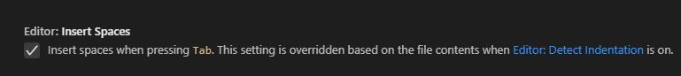
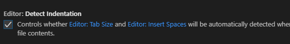
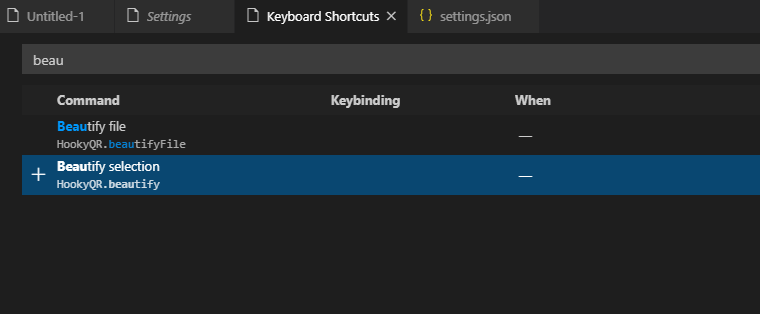
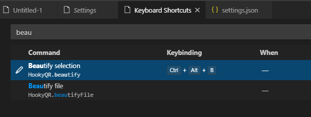
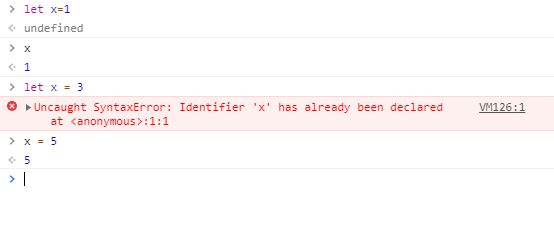
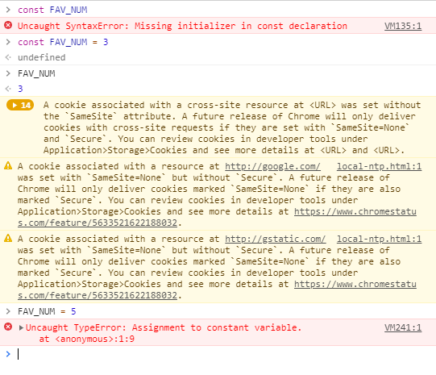
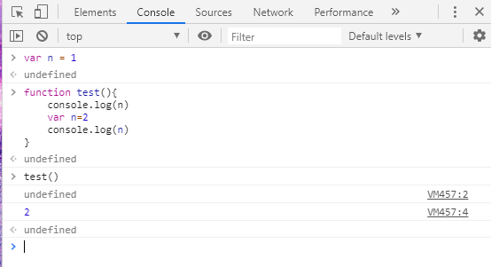
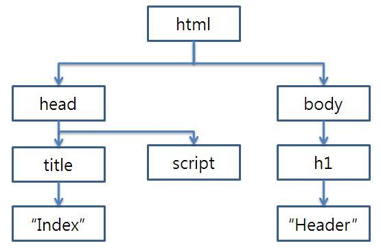

##  *Javascript


### 1. 설정

- [node.js](https://nodejs.org/ko/) , 안정적 신뢰도 높음으로 다운로드

- 설치해준다

- 설치완료 확인은 `node -v`

- ```cmd
  student@M1504 MINGW64 ~/Documents/GitHub/STUDY/Python/Javascript (master)
  $ node -v
  v12.13.1
  #확인 가능!
  ```

- extension 설치!

  - 가로를 자동으로 닫아주는 auto close tag 설치
  - 매칭되는 가로를 이쁘게~ rainbow brackets 설치
  - indent부분을 칼라풀 하게 ~ indent rainbow 설치
  - 코드 정렬을 이쁘게 ~ beautify설치
  - 단축키만 입력하면 실행! code runner 설치
  - eslint 설치
  - 크롬창에서 적용된 내용이 보여진다~ live server 설치

- 설정을 해야한다.

  - vscode에서 file>preference>settings 에서 json 검색

  - edit in settings.json 클릭!

  - ```json
    {
        "terminal.integrated.shell.windows": "C:\\Program Files\\Git\\bin\\bash.exe",
        "window.zoomLevel": 0,
        "editor.snippetSuggestions": "top",
        "editor.tabCompletion": "on",
        "workbench.iconTheme": "vscode-icons",
        "[html]": {
        "editor.tabSize": 2
        },
        "[css]": {
        "editor.tabSize": 2
        },
        "[python]": { // 추가!
        "editor.tabSize": 4,
        },
        "terminal.integrated.fontSize": 16,
        "editor.tabSize": 2,
        
        
        
        "beautify.language": {
        "js": {
        "type": ["javascript", "json"],
        "filename": [".jshintrc", ".jsbeautifyrc"]
        // "ext": ["js", "json"]
        // ^^ to set extensions to be beautified using the javascript beautifier
        },
        "css": ["css", "scss"],
        "html": ["htm", "html", "django-html"]
        // ^^ providing just an array sets the VS Code file type
        },
        
        
        "files.insertFinalNewline": true, //새줄이 자동으로 만들어진채로 종료!
            
        "terminal.integrated.cwd": "${workspaceFolder}",
    }
    
    ```

  - 나의 경우 (ctrl + alt  + n 하면 돌아가지 않는데 `"code-runner.runInTerminal": true`추가하니 output이 아닌 바로 터미널로 접근을 한다!)

  - 확인하고 저장하자.

  - settings 에서 editor: insert space 로 검색

  - 

  - tab시  space가 들어가는지 설정 빈박스로!

  - 파이썬 같을때 tab에 의해서 안되는 경우가 있으므로 해줘야 편하다!

  - settings에서 detext indentation 로 검색

  - 

  - 박스 체크 표시!

- file>preference > keyboard shortcuts

- 

- 단축키 설정하자

- 이걸 해주면 이쁘게 indent가 들어가게 된다.

- 

- 없는 단축키로 설정을 해주자.(편한걸로 하면 된다.)


### 2. Naming Convention

#### 2.1 lowerCamelCase

- 일반적인 Camel case

#### 2.2 UpperCamelCase

- 모든 단어의 첫번째 글자는 대문자로

#### 2.3 snake_case

- _ 를 포함하는 것!

#### 2.4 Hungarian notation

- 변수의 이름앞에 해당 변수의 타입을 표기하는 것
- u16number  / unsigned16bit로 저장되는 것이다.
- s32num / signed32bit로 저장되는 것

#### 2.5 kebab-case

- -하이픈을 사용하여 표시!


### 3. JS 변수

#### 3.1 let

- 변수 타입
- 값을 재 할당할 수 있는  선언 하는 키워드
- 선언은 1번만 가능
- 재할당은 계속 가능!
- 변수의 범위는 blockscope
- 브라우저 f12를 누르고 console에서 작업
- 
- 두번 변수 설정 하니 에러가 뜬다.
- 하지만 재 할당은 에러 없다

#### 3.2 const

- 값이 변하지 않는 상수 선언 키워드
- 선언도 한번만 가능!
- 재할당 불가능!
- block scope 범위를 가진다.
- 
- 선언과 동시에 값을 설정해 주어야 에러가 안뜬다!
- 재설정 안됨을 확인 할 수 있다.

#### 3.3 var

- ES6 이전에 문제가 많이 발생했었다. 외부 변수로 갈 수도 있고 hoisting문제도 있다.

- > #### hoisting
  >
  > 
  >
  > - 하나는 undefined와 2값이 나오게 된다.  
  >
  > - 느낌상 첫번쨰 console.log에서는 1 두번째는 2가 나올 것 같은데 hoisting때문에 n이 먼저 설정이 되고 
  >
  > - ```javascript
  >   function test(){
  >       var n;
  >       console.log(n)
  >       n = 2
  >       console.log(n)
  >   }
  >   ```
  >
  > - 로 인식되어 저런 문제가 생긴다. 이런 문제로 잘 안쓰인다.

  #### 3.4 정리

  - let : 할당은 자유, 선언 1 번 , block
  - const : 할당은 1번, 선언 1 번, block
  - var : 할당 선언 자유지만. 사용하지 않는다.

### 4. 조건문

#### 4.1 if else if

- ```cmd
  const userName = prompt("니 이름이 뭐니?")
  let message = ""
  
  if (userName === "pengsu"){
  	message = "우주 대스타";
  }else if (userName === "그렇구나"){
  	message = "끄덕끄덕";
  }else{
  	message = "<h1>어서오세요. ${userName}</h1>"
  }
  
  message;
  document.write(message)
  
  ```

### 5. loop문(while, for)

#### 5.1 while

- ```js
  let i = 0;
  
  while (i < 10) {
  	console.log(i)
  	i++;
  }
  #ctrl + alt + n 하면 실행한다.
  ```

#### 5.2 for

- ```js
  let i = 0;
  
  // while (i < 10) {
  // 	console.log(i)
  // 	i++;
  // }
  
  // for (let j = 10; j > 0; j--) {
  // 	console.log(j)
  // }
  
  const numbers = [1,2,3,4,5,6,7]
  
  for( let num of numbers){
  	console.log();
  }
  
  
  let sampleObj = {
  	a: 1,
  	b: "hello",
  	c: [3,4]
  }
  
  for ( let obj in sampleObj){ //object의 경우 오류가 나므로 let in 으로!!
  	console.log(obj);
  	console.log.(sampleObj[obj])
  }
  
  ```

### 6. 선언문

#### 6.1 선언식

- ```js
  //선언식
  
  function add(num1 , num2){
  	return num1 + num2
  }
  //미리 선언해 두고 필요할때 사용
  
  let sum = add(5,7)
  
  
  ```

- 선언식은 미리 load가 된다.

#### 6.2 표현식

- ```js
  // 표현식
  const sub = function(num1, num2){
  	return num1 - num2
  }
  
  let val = sub(12, 5)
  console.log(val)
  console.log(typeof sub)
  console.log(typeof add)
  
  ```

### 7. 화살표 함수

#### 7.1 화살표 함수( =  익명함수)

- 익명 함수

- function 표현에 비해 구문이 짧다

- 생성자로 사용할 수가 없다.

- 사용법

  - function을 생략 해도 된다.
  - 인자가 1개인 경우 괄호도 생략 가능
  - body에 표현이 한줄인 경우 return 이랑 {} 생략 가능

- ```js
  const greeting = function(name){
  	return 'hello ${name}'
  }
  
  //1. function 키워드 생략
  const greeting  = (name) => {
  	return 'hello'
  }
  
  //2. 인자가 1개인 경우 괄호도 생략 가능(매개 변수의 개수가 1개인 경우 생략 가능 0게인 경우 () 나 _ 를 사용해 주면 된다!)
  
  const greeting = name =>{
  	return 'hello ${name}'
  }
  
  //3. body(괄호 안의 부분 ) 의 표현식이 1줄인 경우 
  const greeting = name => 'hello ${name}'
  
  ```

- 연습~

- ```js
  // const greeting = function(name){
  // 	return 'hello ${name}'
  // }
  
  // //1. function 키워드 생략
  // const greeting  = (name) => {
  // 	return 'hello'
  // }
  
  // //2. 인자가 1개인 경우 괄호도 생략 가능
  
  // const greeting = name =>{
  // 	return 'hello ${name}'
  // }
  
  // //3. body(괄호 안의 부분 ) 의 표현식이 1줄인 경우 
  // const greeting = name => 'hello ${name}'
  
  // // 실습
  // let square = function(num){
  // 	return num **2
  // }
  
  // let square = (num)=>{
  // 	return num **2
  // }
  
  // const square = num => 'return num ** 2'
  
  
  // let noArags = () => 'no Args'
  // let noArgs = _=>'no Args'
  
  // //object 형식으로 반환 된다면? 가로로 해주면 된다!
  
  // let returnObj = () =>{
  // 	return {key:'value'}
  // }
  let returnObj = () => ({key:'value'})
  console.log(returnObj())
  
  //인자에 기본값을 설정했을 경우
  
  let sayHi = function(name="pengsu"){
  	return 'hi ${name}'
  }
  
  let sayHi = (name="pengsu") => 'hi ${name}'
  console.log(sayHi('bbung'))
  
  
  //즉시 실행 함수
  //즉시 실행 함수 는 왜 쓰나? 초기화 할 때! 
  
  const cube = function(num){
  	return num ** 3
  }//(2)
  
  //익명함수랑 같은데 왜 다른가!? 뒤에 (2) 바로 값을 넣어 줄수 있다.
  
  console.log(cube(2))
  
  //익명함수 즉시 실행 
  
  console.log(function(num){return num ** 3}(2))
  console.log(num => num ** 3(4))
  
  
  
  
  
  ```

### 8.배열

#### 8.1 push, pop , unshift , shift

- ```js
  const numbers = [1, 2, 3, 4, 5, 6, 7]
  console.log(numbers[1])
  console.log(numbers[-1]) //파이썬은 되지만 여기서는 안된다! 양의 정수만 가능!
  console.log(numbers.length)
  
  console.log(numbers.reverse()) //뒤집힌다!
  console.log(numbers) //한번 reverse 면 원본이 뒤집힌다! 주의**
  console.log(numbers[0]) //가장 마지막 번호를 뽑아올 수 있다.  
  
  
  //push 배열의 마지막에 값을 넣어 주는 것 넣어주고 끝나면 배열의 총 길이를 return 해준다.
  numbers.push('peng') ///return 값은 배열의 길이가 된다. (새롭게 추가된 값까지의 길이를 알려준다.)
  console.log(numbers)//맨 마지막에 추가됨을 확인 할 수 있다.
  console.log(number.push('su'))
  
  //pop 빼는 아이
  //맨 마지막 값을 리턴해 준다!
  
  console.log(numbers.pop()) //할때마다 값이 날아갈 것이다! 조심!
  console.log(numbers) //배열에서도 지워버리는 역할
  
  //unshift 배열의 가장 앞쪽에 요소를 추가(length를 리턴해 준다.)
  console.log(numbers.unshift("pengsu"))
  console.log(numbers)
  
  //shift 배열의 가장 앞쪽에 요소를 삭제 (가장 앞의 값을 리턴해준다.)
  console.log(numbers.shift())
  console.log(numbers)
  
  
  ```

#### 8.2 include , join

- ```js
  
  //includes
  console.log(numbers.includes(1)) //ture false로 나오므로 있는지 없는지 확인 가능
  
  console.log(numbers.indexOf(2)) //위치를 알려준다! 어느 위치에 있는지
  
  numbers.push('peng' , 'peng') //값 중복이면 어찌 될까?
  console.log(numbers)
  console.log(numbers.indexOf('peng')) //첫번쨰 오는 인덱스의 값만 반환을 해준다. 중복해도 처음 것만!
  
  //join
  console.log(numbers.join('-')) //1-2-3-4-5-6-7-peng-peng 
  console.log(numbers.join()) //1,2,3,4,5,6,7,peng,peng 기본은 , 이다.
  console.log(numbers.join('')) //1234567pengpeng 다 붙여서!
  console.log(numbers) //(9) [1, 2, 3, 4, 5, 6, 7, "peng", "peng"] 원본은 건드리지 않는다!
  
  
  
  ```

### 9. objects

- ```js
  const pengsu = { //키와 value를 갖는다.
  	name : '펭수' ,
  	"phone number" : '012345678',
  	profile:{
  		deram : '우주대스타',
  		age : '10살',
  		sqpeciality : "요들송",
  	}
  
  }
  console.log(pengsu.name)
  console.log(pengsu['name'])
  console.log(pengsu['phone number'])
  
  console.log(pengsu.profile)
  console.log(pengsu.profile.dream)
  
  
  //before 
  
  var books = ['Learning JS', 'Learning Django']
  var comics = {
  	DC : ['AquaMan' , 'superMan'],
  	marvle : ['IronMan' , 'andMan']
  
  }
  
  var magazins  = null;
  
  var bookShop = {
  	books : books,
  	comics : comics,
  	magazines : magazines,
  }
  console.log(bookShop)
  console.log(typeof bookShop)
  console.log(bookShop.boos[0])
  
  
  //after
  let bookShop = {
  	books,
  	comics,
  	magazines,
  
  }
  console.log(bookShop)
  console.log(typeof bookShop)
  console.log(bookShop.boos[0])
  
  
  
  ```


### 10. json

#### 10.1 키 - 값 형식

- 차이점?

- json이 문자열(string)이기 떄문에 object로 변환하는 중간 과정을 거쳐야 object처리 가능

- json -> object `parse`를 이용해서 전환해 준다.

- ```js
  //JSOn=> object
  let jsonStr = JSON.parse('{"name" : "pengsu" , "age" : "10"}')
  console.log(typeof jsonStr)
  
  
  //object=> JSON
  let obj = {
  	name: 'pengsu',
  	age : '10',
  
  }
  
  console.log(typeof obj)  //아직은 JSON이 아니고
  
  let jsonObj = JSON.stringify(obj);
  console.log(typeof jsonObj) //JSON 으로 바뀜! string으로 찍힌다!!
  
  ```

  

### 11. Array Helper Method

#### 11.1 Array Helper Method

- 일종의 라이브러리다. 자주 사용하는 로직을 재활용 하기 쉽게
- forEach, filter, find, map, every, some, reduce

#### 11.2 forEach

- `array.forEach(callback(element,index,array))`

- ```js
  //예전 방식
  console.log("예전 방식")
  
  var colors = ['red' , 'orange' , 'yellow']
  for (var i = 0; i < colors.length; i++){
  	console.log(colors[i])
  }
  console.log("forEach 방식")
  // use forEach
  const COLORS = ['red' ,'orange' , 'yellow']
  COLORS.forEach(function(color){
  	console.log(color)
  })
  
  
  //즉시실행함수로 
  console.log("즉시실행함수로 ")
  const result = COLORS.forEach(color=> console.log(color))
  //foreach는 아무것도 리턴을 하지 않는다. 
  console.log(result)  //그래서 결과는 undefined가 뜨게 된다.
  
  
  
  
  ```

##### 11.2.1. 실습해보자.

- ```js
  //---------------------------------------------------
  //실습 넘버1 
  console.log("실습넘버1")
  function hadlePosts(){
  	const posts = [{
  		id: 23,
  		title: "오늘의 뉴스",
  
  	},
  	{
  		id: 34,
  		title: "오늘의 스포츠",
  	},
  	{
  		id : 78,
  		title : "오늘의 먹거리"
  	}
  
  	]
  // 실습 2
  //image 배열 안에 있는 정보를 가지고 넓이를 구하고 그 값을 areas에 저장
  
  const IMAGES = [
  	{height: 10 , width: 30},
  	{height: 22 , width: 37},
  	{height: 54 , width: 42},
  ]
  let areas = []
  ```

- ```js
  //---------------------------------------------------
  //실습 넘버1 
  console.log("실습넘버1")
  function hadlePosts(){
  	const posts = [{
  		id: 23,
  		title: "오늘의 뉴스",
  
  	},
  	{
  		id: 34,
  		title: "오늘의 스포츠",
  	},
  	{
  		id : 78,
  		title : "오늘의 먹거리"
  	}
  
  	]
  
  	console.log("예전방식")
  	for (let i = 0; i < posts.length ; i++){
  		console.log(posts[i])
  	}
  	console.log("forEach방식")
  	posts.forEach(post => console.log(post))
  
  }
  //3개의 objects를 가지는 리스트 완성! 
  hadlePosts()
  
  
  // 실습 2
  //image 배열 안에 있는 정보를 가지고 넓이를 구하고 그 값을 areas에 저장
  
  const IMAGES = [
  	{height: 10 , width: 30},
  	{height: 22 , width: 37},
  	{height: 54 , width: 42},
  ]
  let areas = []
  
  function test2(){
  	const IMAGES = [
  		{height: 10 , width: 30},
  		{height: 22 , width: 37},
  		{height: 54 , width: 42},
  	]
  	let areas = []
  	
  	IMAGES.forEach(i => areas.push(i.height * i.width))
  	console.log(areas)
  }
  test2()
  
  ```

  

#### 11.3 map

- `arry.map(callback(element,index))`

- 배열 내에 모든 값을 변환 시킬 때 사용하게 된다.

- 새롭게 배열을 만들기 때문에 원본을 유지해준다.

- ```js
  //배열에 모든 요소에 2를 곱하여 새로우 배열로 만들기
  //before
  console.log("★ before")
  var numbers = [1, 2, 3]
  var doubleNumber = []
  
  for (var i = 0; i < numbers.length ; i++){
  	doubleNumber.push(numbers[i]*2)
  }
  console.log("원값 : ",numbers)
  console.log("계산값 : " , doubleNumber)
  // map 을 사용해 보자
  
  console.log("★ map사용")
  let NUMBERS = [2 , 4 , 6] //let으로 해서 원본을 바꾸는지 새롭게 배열을 만드는지 확인해보자~
  let  doubleNum = NUMBERS.map(function (num){
  	return num * 2
  }) //map 알아서 배열로 만들어 주기 떄문에  push를 사용해 줄 필요가 없다!
  
  let doubleNum2 = numbers.map(num => num * 2)
  
  console.log("원본값:" ,NUMBERS)
  console.log("새로운 값일까?: ",doubleNum)
  console.log("map : ", doubleNum2)
  
  
  ```

##### 11.3.1 . 실습해보자.

- ```js
  // 실습 1
  // 숫자가 담긴 배열을 받아서
  // 각 숫자들의 제곱근이 들어있는 새 배열로 만들기
  const newNum = [4, 9, 16]
  
  // 실습 2 
  // images 배열 안에 Objects 들의 height만 저장되어있는 배열을 만들자.
  const IMAGES = [
  	{height : '34px' , width: '39px'},
  	{height : '44px' , width: '79px'},
  	{height : '87px' , width: '19px'}
  ]
  
  
  //실습 3
  //{name : brand , movie : 영화}
  //object로 합쳐주자~예상 결과값은
  //[{name:Marvel , movie:Avergers} , {name:DC, movie:Batman}]
  
  const brands = ["Marvel" , "DC"]
  const movies = ["Avengers" , "Batman"]
  ```

- ```js
  // 실습 1
  // 숫자가 담긴 배열을 받아서
  // 각 숫자들의 제곱근이 들어있는 새 배열로 만들기
  
  console.log('★ 실습1')
  const newNum = [4, 9, 16]
  let roots = newNum.map(num => num ** 0.5)
  console.log(roots)
  
  // 실습 2 
  // images 배열 안에 Objects 들의 height만 저장되어있는 배열을 만들자.
  console.log('★ 실습2')
  const IMAGES = [
  	{height : '34px' , width: '39px'},
  	{height : '44px' , width: '79px'},
  	{height : '87px' , width: '19px'}
  ]
  
  let ww = IMAGES.map(w => w.height)
  
  console.log(ww)
  
  //실습 3
  //{name : brand , movie : 영화}
  console.log('★ 실습3')
  const brands = ["Marvel" , "DC"]
  const movies = ["Avengers" , "Batman"]
  
  const Heroes = brands.map(function (brand, idx){
  	return {name : brand , movie : movies[idx]} //인덱스로 선택을 해주면 OK
  })
  const Heroes2 = brands.map((brand,idx) => ({name:brand , movie:movies[idx]})) 
  //인자가 두개이기 떄문에 () 생각 불가능이므로 (brand, idx) , 해 주고 {}가 있으므로 ({}) 해주어야한다.
  console.log(Heroes)
  console.log(Heroes2)
  
  
  
  ```


#### 11.4. filter

- `array.fliter(callback(element,..))`

- 새로운 배열로 리턴을 해준다. 원하는 요소를 필터링 할 수 있다.

- 새롭게 배열을 만들어 리턴을 해준다. 기존의 원본 유지한다.

- ```js
  const products = [
  	{ name : 'cucumber' , type : 'vegetable'},
  	{ name : 'banana' , type : 'fruit'},
  	{ name : 'carrot' , type : 'vegetable'},
  	{ name : 'apple' , type : 'fruit'},
  ]
  
  //type이 과일이 친구만 뽑기 위해서는?
  
  //befor
  console.log("★  befor")
  var selectProducts = []
  for (var i = 0 ; i < products.length; i++){
  	if(products[i].type === "vegetable"){
  		selectProducts.push(products[i])
  	}
  }
  
  console.log(selectProducts)
  
  
  //filter 로
  console.log("★  filter")
  
  let selectProducts2 = products.filter(function(prod){
  	return prod.type === "vegetable"
  
  })
  console.log("filter : ",selectProducts2)
  console.log("원본 : " , products)
  
  
  
  ```

##### 11.4.1 실습

- ```js
  //실습 1
  //80점 이상인 결과만 따로 배열로 만들기
  ```

- ```js
  //실습 1
  //80점 이상인 결과만 따로 배열로 만들기
  const testResults = [90, 85, 70, 78, 100, 86, 99, 82]
  let test1 = testResults.filter(score => (score>=80))
  console.log(test1)
  console.log(testResults)
  //원본 데이터를 건드리지 않음을 확인 할 수 있다.
  ```


#### 11.5 . reduce

- 배열내의 시험 같은 점수가 있고, 평균을 내고 싶을 때 이용하게 된다.

- `array.reduce(callback(acc , element, idx ))` 첫번째는 누적된 값, element, idx순서이다.

- 배열의 길이만큼 나눠주면 평균을 구하기 쉽다!

- 다른것과 다르게 이전값을 계속 가지고 사용 가능하다. 이를 이용해서 평균, 총합등을 구하게 된다.

- ```js
  //배열의 총합을 구하기
  const numbers = [1, 2, 3, 4]
  
  // before
  console.log("★  before")
  let total = 0;
  for (let i = 0 ; i< numbers.length ; i++){
  	total += numbers[i]
  }
  console.log(total)
  
  //reduce
  console.log("★  reduce")
  let sum = numbers.reduce(function(total, num){ //total로 이전값을 분류 (total=이전값이 된다.)
  	return total += num //이전값에 현재값을 계속 더해주면!!! 총합이 된다.
  }, 0) //마지막에는 
  console.log("총합 : ",sum)
  console.log("이전값  :  " , numbers)
  
  ```

  

##### 11.5.1 실습

- ```js
  //실습 1
  //평균 구하기
  
  const testResults = [90, 85, 70, 78, 58, 86, 99, 82]
  
  // 실습 2
  // 배열에 담긴  이름이 중복되면 {이름: 중복 횟수} 로 반환 해보자.
  const names = ['pengsu' , 'bbung', 'pororo' , 'bbung' , 'bungaeman' , 'pengsu']
  
  ```

- ```js
  
  //실습 1
  //평균 구하기
  
  const testResults = [90, 85, 70, 78, 58, 86, 99, 82]
  let avg = testResults.reduce((aa,aaa) => (aa += aaa),0)/testResults.length
  
  
  console.log(avg)
  
  
  // 실습 2
  // 배열에 담긴  이름이 중복되면 {이름: 중복 횟수} 로 반환 해보자.
  const names = ['pengsu' , 'bbung', 'pororo' , 'bbung' , 'bungaeman' , 'pengsu']
  let count = 0
  let nameResults = names.reduce(function(allNames, name){ //allNames에 계속 값을 들고 있게 된다.
  	if (name in allNames){ //object안에 값을 확인 하는 것!
  		allNames[name] += 1
  	}else{
  		allNames[name] = 1
  	}
  	return allNames
  },{})
  
  console.log(nameResults)
  
  
  
  ```


#### 11.6 find

- `array.find(callback(element,index,array))`

- 찾아서 하나만! 리턴을 하게 된다.  즉 주어진 조건을 만족하는 첫번째 요소를 리턴해 주는 것

- ```js
  let heros = [
  	{ name : 'Tony Stark', age: 45}, //object 를 만든다!
  	{ name : 'Captin Ame', age: 82}, //object 를 만든다!
  	{ name : 'Thor', age: 1500}, //object 를 만든다!
  	{ name : 'Tony Stark', age: 25}, //object 를 만든다!
  ]
  
  
  //before
  console.log("★  before")
  var hero = {}
  for(var i = 0 ; i < heros.length ; i++){
  	if(heros[i].name === 'Tony Stark'){
  		hero = heros[i]
  		break; //첫번째 값만 구할 것이기 떄문에 스탑!
  	}
  }
  
  console.log(hero);
  
  
  //find
  console.log("★  find");
  
  let hero1 = heros.find(function (hh){
  	return hh.name === "Tony Stark"
  })
  
  ```

- 

##### 11.6.1 실습

- ```js
  //실습
  //잔액이 2만원 이상인 사람의 이름을 출력해 보자.
  
  const ACCOUNTS = [
  	{name: "pengsu" , money: 1200},
  	{name: "bbung" , money: 24000},
  	{name: "pororo" , money: 50000},
  ]
  
  ```

- ```js
  //실습
  //잔액이 2만원 이상인 사람의 이름을 출력해 보자.
  
  const ACCOUNTS = [
  	{name: "pengsu" , money: 1200},
  	{name: "bbung" , money: 24000},
  	{name: "pororo" , money: 50000},
  ]
  
  
  let pp = ACCOUNTS.find(p => p.money > 20000)
  console.log(pp);
  
  
  
  
  ```

  
  


#### 11.7  some & every

- some - 조건에 맞는 요소를 찾으면 즉시 검색을 멈추고 true값을 리턴

- every - 모든 요소에서 해당 요소를 만족하지 않는 것이 나오면 검색 멈추고 false를 리턴.

- ```js
  const NUMBERS = [1,2,3,4,5]
  
  //some
  
  const sresult = NUMBERS.some(function(elem){
  	return elem % 2 === 0
  })
  console.log(sresult);
  
  //every
  const eresult = NUMBERS.every(function(elem){
  	return elem % 2 === 0
  })
  console.log(eresult);
  
  
  
  
  ```


### 12. 콜백함수

#### 12.1 CallBack function

- 다른 함수에 인수로 넘겨지는 함수

- ```html
  <!DOCTYPE html>
  <html lang="en">
  <head>
  	<meta charset="UTF-8">
  	<meta name="viewport" content="width=device-width, initial-scale=1.0">
  	<meta http-equiv="X-UA-Compatible" content="ie=edge">
  	<title>Document</title>
  </head>
  <body>
  	<button id="myButton">눌러 볼래?</button>
  	<script>
  	const button = document.getElementById('myButton') //위의 버튼을 가르킨다.
  	button.addEventListener('click' , function(){ //익명함수를 실행하도록 설정~
  		console.log('눌렀니?');
  		
  	})
  
  	function doSomething(task, callback){
  		alert(`자 ,${task} 준비를 해봅시다!`)
  		callback()
  	}
  	
  	////콜백에 익명함수 넣기~
  	// doSomething('탕수육 먹을', function(){
  	// 	alert(`뿜바이로 맛난 탕슉 먹으러 갑시다!`)
  	// })
  
  
  	//콜백에는 기명함수도 넣을 수 있다.
  	function whereGo(){
  		alert(`탕슉 어디가 맛나나요?`)
  	}
  
  	doSomething('탕수육 먹을' , whereGo)
  	</script>
  
  	
  </body> 
  </html>
  
  ```

- ```html
  <!DOCTYPE html>
  <html lang="en">
  <head>
  	<meta charset="UTF-8">
  	<meta name="viewport" content="width=device-width, initial-scale=1.0">
  	<meta http-equiv="X-UA-Compatible" content="ie=edge">
  	<title>Document</title>
  </head>
  <body>
  	<p id = "para">어떤 휴지 줄까?</p>
  	<button onclick = "changeColor('red', function(newColor='red'){
  		alert(`${newColor} 휴지 줄게요~`)
  	})">빨간 휴지</button>
  
  	<button onclick = "changeColor('red', _	=>alert(`빨간 휴지 줄게요~`))">빨간 휴지</button>
  
  	<button onclick = "changeColor('blue', function(newColor = 'blue'){
  		alert(`${newColor} 휴지 줄게요~`)
  	})">파란 휴지</button>
  	
  	<script>
  		function changeColor(newColor, callback){
  			const elem = document.getElementById('para')
  			elem.style.color =  newColor
  			callback()
  		}
  
  		
  
  	
  	</script>
  </body>
  </html>
  
  ```

### 13. EventListener

- [자바스크립트 이벤트 정리 사이트](http://www.ktword.co.kr/word/abbr_view.php?m_temp1=2744&id=1356) 이므로 클릭해서 확인해 보자~

#### 13.1 이벤트 설정

- `EventTarget.addEventlistener(type,callback)`
- **EventTarget** : 이벤트 리스너를 등록할 대상
- **type** : 이벤트 유형을 뜻하는 문자열
- **call back** : 이벤트가 발생했을때 처리를 담당, e(event 객체) 

####  13.2 이벤트 발생 절차

1. 무엇을?
   - EventTarger 을
2. 언제?
   - type 이벤트가 발생했을때?
3. 어떻게?
   - callback 함수에 구현된 내용을 실행

#### 13.3 실습

- ```html
  <!DOCTYPE html>
  <html lang="en">
  <head>
    <meta charset="UTF-8">
    <meta name="viewport" content="width=device-width, initial-scale=1.0">
    <meta http-equiv="X-UA-Compatible" content="ie=edge">
    <title>Document</title>
  </head>
  <body>
    <div id="my"></div>
      <button id="this-button">이것을 누르면 ?</button>
  
  
    <script>
      //어디에 이벤트를 등록할 것인가! 버튼에 할것이당
      //1. 무엇을? EventTarget
      const button = document.querySelector('#this-button')
  
      // 2. 언제? 첫번째 인자 클릭했을 때 (콜백함수 사용 할 것이다~ )
      button.addEventListener('click', function(e){
        console.log(e);
        // 3. 어떻게? div에 뿅이라고 적어주기.
        const div = document.querySelector('#my')
        div.innerHTML = '<h1>뿅!</h1>'
        
      })
  
      
    </script>
  </body>
  </html>
  
  ```

### 14. BOM & DOM

#### 14.1 BOM

- BOM(Browser Object Model)

  - JS 브라우저와 소통하기 위한 모델
  - 브라우저 제작사마다 세부내용이 다르고 , 다르게 구현되며,  한정적이다.

- 웹 브라우저의 버튼, URL 주소 입력, 타이틀바 같은 브라우저 일부분을 제어 할 수 있다.

- window 객체로 접근 가능

  - 전역 JS 객체, 함수, 변수들은 자동으로 window 객체의 멤버가 된다.
  - HTML DOM 역시 window 객체의 속성

- ```js
  window.print() //인쇄
  window.open() // 탭 오픈 (브라우저 오픈)
  window.document //document 도 브라우저 종속 -> window 전역객체에 포함
  window.confirm() // 확인 &취소 버튼이 있는 대화상자를 표시
  ```

#### 14.2 DOM

- DOM(Document Object Model)
- HTML 파일에 작성된 요소(element)들을 조작할 수 있다. 
- 요소에 이벤트 를 등록해서 , 특정 이벤트가 발생할 시 특정 함수를 실행하도록 할 수 있다.
- HTML 문서에 작성하지 않은 내용도 새로운 요소를 생성해서 추가할 수 있다.(삭제도 가능)

#### 14.3 DOM- Tree

- 

- html 해드 태그를 tree형태로 보여주는 것을 뜻한다.

- 요소를 선택하여 변수를 할당

- document의 querySelector 로 가져온다. (다른 방법도 있다 =>getElementById, ...)

- **querySelector** : 위에서 부터 선택자 요소를 찾으며 가장 먼저 찾아지는 요소를 반환

- **querySelectorall** : 일치하는 모든 요소를 반환

- ```js
  const bg = document.querySelector('.bg') //id 값이 bg인 것
  ```

- 부모에서 자식요소 선택하기

- ```js
  const movcon = bg.querySeletor('#movcon') //id가 movcon인 것
  ```

- 

#### 14.3 실습

- ```html
  <!DOCTYPE html>
  <html lang="en">
  <head>
    <meta charset="UTF-8">
    <meta name="viewport" content="width=device-width, initial-scale=1.0">
    <meta http-equiv="X-UA-Compatible" content="ie=edge">
    <title>Document</title>
    <style>
    .bg {
      background-color : skyblue;
      justify-content: center;
      align-items:  center;
      min-height: 100vh;
      display: flex;
    }
    </style>
  </head>
  <body>
    <div class="bg">
      
    </div>
  </body>
  </html>
  
  ```

- 

- ```cmd
  const bg = document.querySelector('.bg')
  undefined
  
  bg
  <div class=​"bg">​…​</div>​
  
  const movcon = document.querySelector('#movcon')
  undefined
  
  movcon
  ​
  
  movcon.id
  "movcon"
  
  movcon.src
  "https://encrypted-tbn0.gstatic.com/images?q=tbn%3AANd9GcSEjDt804wiEv_YncblPzHLgQPh5MXX_YPIJ8jsFCnfFTimOhrx"
  
  
  movcon.src=""
  ""
  
  
  const bg = document.querySelector('.bg')
  undefined
  
  bg.firstElementChild
  ​
  
  bg.firstElementChild.remove()
  #삭제~
  ```

- 태그를 만들어서 추가해보자

- ```html
  const newMovcon = document.createElement('img')
  undefined
  
  newMovcon
  ​
  
  newMovcon.id = 'movcon2'
  "movcon2"
  
  newMovcon
  ​
  newMovcon.src="이미지링크"
  newMovcon
  
  const bg = document.querySelector('.bg')
  undefined
  bg.append(newMovcon)
  ```

- 이미지링크를 적절한 것을 넣으면 확인 할수 있다.

#### 14.4 공룡 움직이기

- ```html
  <!DOCTYPE html>
  <html lang="en">
  <head>
    <meta charset="UTF-8">
    <meta name="viewport" content="width=device-width, initial-scale=1.0">
    <meta http-equiv="X-UA-Compatible" content="ie=edge">
    <title>Document</title>
    <style>
    .bg {
      background-color : skyblue;
      justify-content: center;
      align-items:  center;
      min-height: 100vh;
      display: flex;
    }
    </style>
  </head>
  <body>
    <div class="bg">
      
      
    </div>
  
    <div class="bg">
      
    </div>
  
    <script>
      document.addEventListener('keydown' , function(event){
        if (event.code === 'Space'){
          console.log('눌렀다 스페이스바');
          
        }else if(event.code === 'ArrowUp'){
          console.log('눌렀다 윗쪽키');
          
        }else if(event.code === 'ArrowDown'){
          console.log('눌렀다. 아래로');
          
        }else if(event.code === 'Arrowleft'){
          console.log('눌렀다. 왼쪽키');
          
        }else if(event.code === 'ArrowRight'){
          console.log('눌렀다 오른쪽키')
        }else{
          console.log('뭔가가 눌렸따.');
          
        }
  
      })
    </script>
  </body>
  </html>
  
  ```

#### 14.5 고양이 피하기

- ```html
  <!DOCTYPE html>
  <html lang="en">
  <head>
    <meta charset="UTF-8">
    <meta name="viewport" content="width=device-width, initial-scale=1.0">
    <meta http-equiv="X-UA-Compatible" content="ie=edge">
    <title>Document</title>
    <style>
    .bg {
      background-color : skyblue;
      justify-content: center;
      align-items:  center;
      min-height: 100vh;
      display: flex;
    }
    </style>
  </head>
  <body>
    <div class="bg">
      
      
    </div>
  
    <div class="bg">
      
    </div>
  
    <script>
      const dino = document.querySelector('#dino')
      x= 0 , y=0;
      document.addEventListener('keydown' , function(event){
        if (event.code === 'Space'){
          console.log('눌렀다 스페이스바');
          
        }else if(event.code === 'ArrowUp'){
          console.log('눌렀다 윗쪽키');
          y -= 20
          dino.style.marginTop= `${y}px` //위가 뛰어 오르려면 아래에 마진을 주어야 한다.
        }else if(event.code === 'ArrowDown'){
          console.log('눌렀다. 아래로');
          y += 20
          dino.style.marginTop = `${y}px`
        }else if(event.code === 'ArrowLeft'){
          console.log('눌렀다. 왼쪽키');
          x -= 20
          dino.style.marginLeft = `${x}px`
        }else if(event.code === 'ArrowRight'){
          console.log('눌렀다 오른쪽키')
          x += 20 
          dino.style.marginLeft = `${x}px`
        }else{
          console.log('뭔가가 눌렸따.');
          
        }
  
      })
  
      const movcon = document.querySelector('#movcon') //movcon이란 id의 내용을 movcon에 저장한다.
      movcon.style.position = 'absolute' 
      //윈도우 브라우저의 사이즈를 받아 오기 위해서 //BOM의 객체는 window임을 이용 
      //window.innerWidth : 브라우저 창의 너비
      //window.innerHeight : 브라우저 창의 높이 // 여기에 마진값을 주면 그 만큼 움직이게 될 것이다.
      movcon.addEventListener('mouseover' , function(){
        //(현재 윈도우의 너비 * 랜덤한 값(Math.random())) - (윈도우의 너비 / 2)
  
        const newWidth = window.innerWidth *  Math.random() - window.innerWidth / 2
        const newHeight = window.innerHeight *  Math.random() -  window.innerHeight / 2
        
        
        movcon.style.marginLeft = newWidth + 'px'
        movcon.style.marginTop = newHeight + 'px'
  
      })
    </script>
  </body>
  </html>
  
  ```

#### 14.6 javascript CRUD

- ```html
  <!DOCTYPE html>
  <html lang="en">
  <head>
    <meta charset="UTF-8">
    <meta name="viewport" content="width=device-width, initial-scale=1.0">
    <meta http-equiv="X-UA-Compatible" content="ie=edge">
    <title>Document</title>
  </head>
  <body>
    <h2>My Wish List</h2>
    내가 원하는 건 : <input type="text" id="wish-input">
    <button id="add-button">추가하기</button>
  
    <ol id="wish-list">
  
    </ol>
    <script>
      //---------------------------------------------------생성
      // 1. input 태그를 선택하여 변수에 담는다.
        const ww = document.querySelector('#wish-input')
      // 2. 버튼을 태그를 선택하여 변수에 담는다.
        const bb = document.querySelector('#add-button')
      // 3. ol 태그를 선택하여 변수에 담는다.
        const oo = document.querySelector('#wish-list')
      // 4. 클릭을 했을때 의 동작 
  
        bb.addEventListener('click' , function(){
          // 5. input 태그에 value를 변수에 담는다.
          const vv  = ww.value;
                  
          // 6. input 태그에 입력되어진 value를 초기화 한다.
          ww.value= "";
          // 7. li 태그를 생성해서 변수에 담는다. 
          const ll = document.createElement('li')
                  
          // 8 li 태그가 저장된 변수에 input value를 담는다. .innerText
          ll.innerText = vv
          //-------------------------------------------------삭제
          // 2-1 delete 버튼 태그 생성
          const delButton = document.createElement('button')
          // 2-2 delete 버튼에 버튼 이름 지정해 주기
          delButton.innerText = "목표성취"
  
          // 2-3 delete 버튼을 ll 에 마지막 요소로 추가(자식으로 들어가게 된다.)
          ll.append(delButton)
  
          // 2-4 버튼을 누르면 해당 아이템을 삭제
          delButton.addEventListener('click', function(){
            ll.remove()
          })
          // 9 ol 태그에 li  요소를 추가
          
          oo.append(ll)
  
  
        })
    </script>
    <!--script 의 경우 로딩이 오래 걸리기 때문에 미리 하지 않고 먼저 형식을 보여주고 나중에 로딩하는 방식으로 하기위해서
    또한 가끔 이벤트의 경우 script가 먼저 읽혔을때 없다고 잘못 인식하는 경우도 있기 때문에 마지막에 위치하는것이 가장 바람직하다.-->
  </body>
  </html>
  
  ```

  