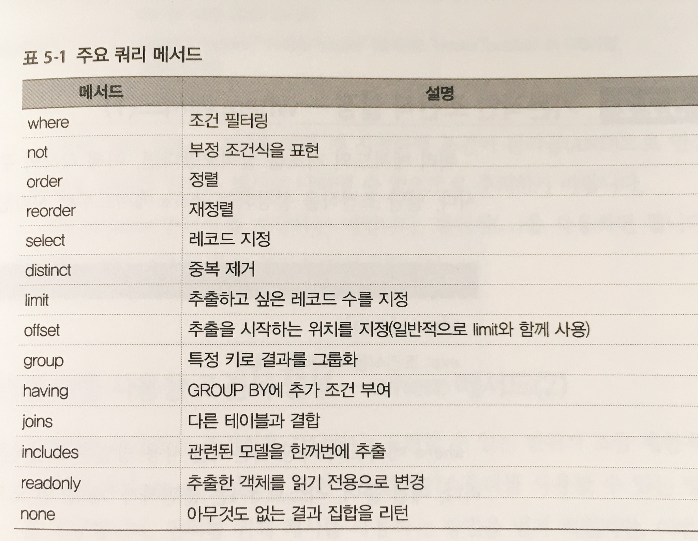
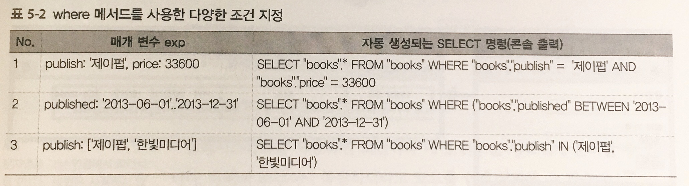

## Rails

### 1. model 

##### 1.1 find 메서드

```ruby
#book이란 이름의 테이블
books = Book.find([2,5,10])
```

```sql
select "books".*from "books" where "books"."id" in (2,5,10)
```

##### 1.2 find_by 메서드

```ruby
book = Book.find_by(publish: '제이펍')
```

```sql
select "books".*from "books" where "books"."publish" = '제이펍' limit 1
```


### 2. 복잡한 쿼리 메서드

##### 2.1 주요 쿼리 메서드




- 이러한 메서드의 특징은 find와 find_by등과는 다르게 메서드를 호출하는 시점에서 데이터베이스에 접근하지 않는다. 조건식에 들어가 있는 결과는 ActiveRecord::Relation객체로 리턴한다. 이후 쿼리 결과가 필요한 시점에 데이터 베이스에 접근하는데 이를 **지연로드(Lazy Load)** 라 한다. 
- 이런 성질로 인해 다음과 같은 코드를 작성하는것이 가능하다.
- `@books = Book.where(publish: '제이펍').order(published: :desc)`
- 위의 예에서는 where메서드로 조건식(where 구)를 추가하고 order 메서드로 정렬식(ORDER BY 구 )을 추가했으므로 최종적으로는 `select "books".*from "books" where "books"."publish" = '제이펍' order by published DESC`와 같이 생성가능하다. 메서드를 연결해서 사용할 수 있는 이러한 형태를 **메서드체인**이라고 부른다.


##### 2.2 where

```ruby
@books = Book.where(publish: '제이펍')
```

```sql
select "books".*from "books" where "books"."publish"  = '제이펍'
```



- 1 처럼 `"<필드이름>:<값>"` 을 여러 개 지정하면 조건이 논리곱(AND)으로 연결됩니다. 논리합 연산은 해시 값으로 나타낼 수 없으므로 주의!
- 2 처럼 between 연산자를 지정하는 예로서 범위식(..)을 사용하면 된다. 
- 3 처럼 배열 을 지정하면 in연산자가 사용된다.

##### 2.3 where(2)

- 해시를 사용하는 조건식은 간단하지만, 표현할 수 있는 범위가 조금 제한적이다. 따라서 where 메서드는 조건식에 **플레이스홀더**르를 사용할 수 있는 방법을 제공한다.
- **플레이스홀더** 란 매개 변수를 두는 장소이다. 플로에스 홀더를 사용하면 조건식을 실행할 때 원하는 매개 변수를 전달 할 수 있다. 

```ruby
books = Book.where('publish = ? AND price >= ?', params[:publish], params[:price])
```

```sql
select "books".*from "books" where (publish = '제이펍' and price >= '3000')
```

- 플레이스 홀더를 이용하는 이유는 이를 사용하지 않고 조건식을 생성하면 sql인젝션이라는 불리는 취약성의 원인이 된다.

  > SQL Injection 이란 악의적인 사용자가 보안상의 취약점을 이용하여, 임의의 SQL 문을 주입하고 실행되게 하여 데이터베이스가 비정상적인 동작을 하도록 조작하는 행위 입니다. 인젝션 공격은 OWASP Top10 중 첫 번째에 속해 있으며, 공격이 비교적 쉬운 편이고 공격에 성공할 경우 큰 피해를 입힐 수 있는 공격입니다.

##### 2.4 이름있는 매개변수 이름없는 매개변수

- ? 기호로 플레이스홀더를 사용했지만 :<이름> 의 형태로 플레이스 홀더를 지정하는 것도 가능하다. 앞의 형태를 이름없는 매개 변수, 뒤의 형태를 이름있는 매개 변수라 부른다.

```ruby
books = Book.where('publish = :publish AND price >= :price', publish: params[:publish], price: params[:price])
```

|                     | 장점                                     | 단점                                                         |
| ------------------- | ---------------------------------------- | ------------------------------------------------------------ |
| 이름 있는 매개 변수 | 매개 변수의 대응 관계를 쉽게 알 수 있다. | 코드가 길어진다.                                             |
| 이름 없는 매개 변수 | 코드 자체는 간단                         | 매개 변수의 대응 관계를 알기 힘들다.<br />매개 변수의 증감 또는 순서 변화에 영향을 받는다. |

- 두 가지 모두 장점과 단점이 있다. 일반적으로는 매개 변수 수가 적은 경우에는 이름 없는 매개 변수, 매개 변수가 많은 경우에는 이름 있는 매개 변수를 사용할 것을 추천한다.

### 다음 공부할 것...

