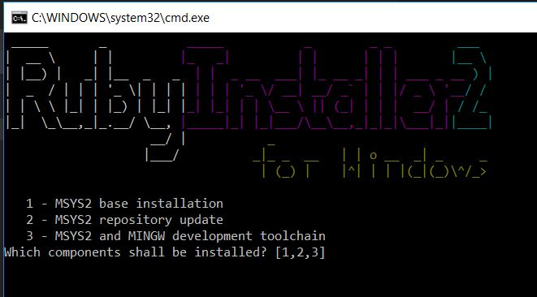
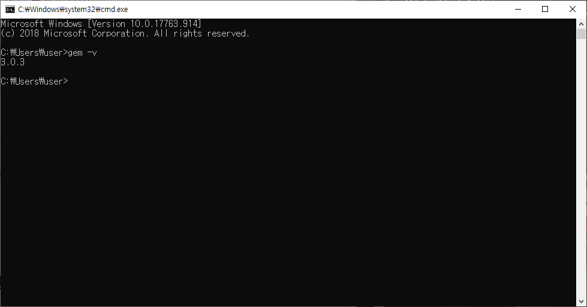
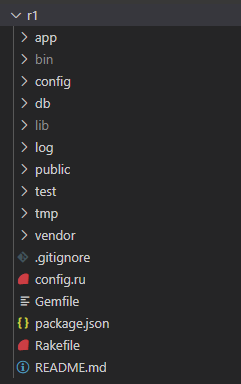
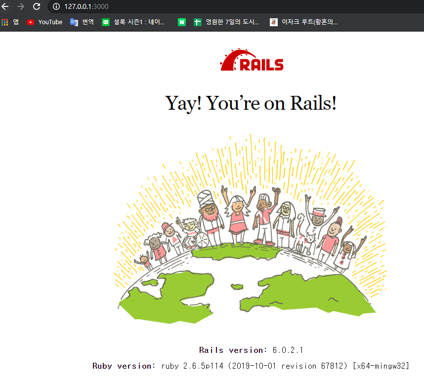
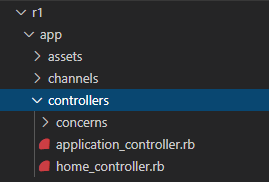
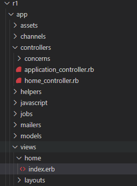
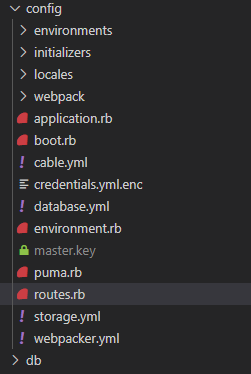

[공부참고 사이트](http://rubylearning.com/satishtalim/numbers_in_ruby.html)

#  Ruby 설치

- Ruby  다운로드 [위치](https://rubyinstaller.org/downloads/)는 이곳이다.클릭!

- 실행후 설치

- 완료하면 

- 

- 파일이 뜨며 1 , 2 , 3 을 순서대로 설치해준다.

- 

- cmd창에서 `gem -v`를 사용해 버전을 확인하여 설치를 확인한다.

- ` gem install jekyll`를 설치...하라는데 이게뭐딩? 

  > [Jekyll](https://jekyllrb.com/)은 여러(특히 마크다운) 형태의 텍스트와 테마를 소스로 하여 정적 HTML 웹사이트를 제너레이트하는 툴이다. Ruby 스크립트로 만들어져 있으나, 블로그를 만드는 데에는 루비를 전혀 몰라도 된다. 출처 네이버
  >
  > 한마디로 심플하고 블로그 지향적인 정적 사이트 생성기이다. Liquid 기능이 추가된 HTMl 템플릿을 사용해 사이트의 모양을 만들고 Jekyll 은 자동으로 내용물과 템플릿들을 함께 함쳐 어떤 서비스에서도 작동하는 완전한 정적 웹 사이트를 생성한다. github  pages의 내부 엔진이기 때문에 github서버에 무료로 호스팅 할 수 있다.


## Hello ruby

- 먼저 기본 실행을 확인해보자.

- ```ruby
  #ru_1.rb
  puts 'hello world'
  ```

- console창에서 `ruby rb_1.rb`를 작성하면 파일 실행이 되면서 확인할 수 있다.


## ~~ruby and rails~~

## 윈도우에서 개발환경 설정

- ~~레일스 인스톨러 이용하여 설치!~~

- ~~[설치위치](http://railsinstaller.org/en)는 이곳을 참고한다.~~ ==> 하지만 이걸로 했을때 오류가 났기 때문에! 취소!

- 번들러 최신화

- ```bash
  gen install rails #루비를 통해 rails를 설치할 수 있다.
  gem install bundler
  #번들러 최신업데이트! 번들러를 통해 젬의 의존성을 관리한다.
  gem install sqlite3
  #이것이 없으면 프로젝트 생성시 오류가 생긴다~
  
  ```
  
- node.js를 설치해주자~ 프로젝트 생성시 필요한지 미리 설치를 요구한다.

- [설치장소](https://nodejs.org/ko/)는 여기다.

- yarn또한 설치해 주어야 한다. [설치장소](https://yarnpkg.com/lang/en/docs/install/#windows-stable)는 여기다. 

- ```cmd
  choco install yarn
  ```

- 

## 프로젝트 생성!

- ```bash
  rails new <프로젝트 이름>
  ```

- 

- r1으로 프로젝트 이름을 만들었고 자동 생성됨을 확인 할 수 있다.

## 서버 실행

- ```bash
  cd <프로젝트이름> #프로젝트 파일안에서 서버실행 해주어야 한다.
  rails s
  # s는 server의 약자이다.
  ```
  
- 로 실행한다. 실행은 r1 (만든 프로젝트이름) 파일안에 cd로 이동한 후 실행하도록 한다.

- `127.0.0.1:3000`으로 실행되며(다를수도..?)

- 

- 브라우저 확인 가능하다~


## 기본 구조

### 1. 브라우저와 서버

- 브라우저 : 클라이언트
- 서버 : Rails서버는 MVC패턴으로 이루어져 있기 떄문에 Model, View , Controller가 서로 상호작용하여 정보를 가공

#### 1.1 서버와 클라이언트간 데이터교환

- 클라이언트가 서버에 연결 요청
- 서버는 클라이언트에 확인 메시지, 클라이언트는 확인메시지를 받았다는 확인 메시지를 서버에
- TCP연결 완료

#### 1.2. 브라우저(클라이어언트)

- HTML, CSS파일을 읽어, 사용자가 사용하기 편하도록 화면상에 띄워준다.
- JS파일을 읽어 화면을 동적 구성

#### 1.3. 서버가 하는 일

- Model : 어플리케이션 데이터와 정보 
- View : 데이터 표현 , 동적  정적 표현.
- Controller  :  Model과  View를 이어주며, 데이터 가공을 수행


### 2. 새로운 페이지 만들기

#### 2.1 페이지 생성 조건

1. controller action 존재
2. action과 연결된 view파일 존재
3. routes.rb에 url과  action이 연결

#### 2.2 Controller와 action 생성

```bash
user@DESKTOP-OT4VEF9 MINGW64 /d/gitgithub/STUDY/Ruby (master)
$ cd r1

user@DESKTOP-OT4VEF9 MINGW64 /d/gitgithub/STUDY/Ruby/r1 (master)
$ ls
app              config     Gemfile       log           postcss.config.js  README.md  tmp
babel.config.js  config.ru  Gemfile.lock  node_modules  public             storage    vendor
bin              db         lib           package.json  Rakefile           test       yarn.lock

user@DESKTOP-OT4VEF9 MINGW64 /d/gitgithub/STUDY/Ruby/r1 (master)
$ rails generate controller home
      create  app/controllers/home_controller.rb
      invoke  erb
      create    app/views/home
      invoke  test_unit
      create    test/controllers/home_controller_test.rb
      invoke  helper
      create    app/helpers/home_helper.rb
      invoke    test_unit
      invoke  assets
      invoke    scss
      create      app/assets/stylesheets/home.scss
#컨트롤러 삭제는
# rails d controller <컨트롤러명> <액션명>
# d는 destroy의 약자! g 는 generate 의 약자!
# 액션 생성을 동시에 하는 경우 
```

- 먼저 컨트롤러 생성 위해서 bash창에 입력!
- 
- 이렇게 컨트롤러 밑에 home_controller.rb파일이 생성된다.

- home_controller.rb파일로 들어가면

- ```ruby
  class HomeController < ApplicationController
  end
  #이렇게 존재~
  ```

- ```ruby
  class HomeController < ApplicationController
  	def index
  	end
  end
  
  ```

- index라는 액션을 만든다.

- View파일 생성 위해서

- 

- app>vies>home파일에 index.erb 를 생성하자~

- 이곳에서 html 코드를 입력할 수 있다.

#### 2.3 routes.rb로 url과  action 연결

- 

-  app > config > routes.rb 폴더안에는

- ```ruby
  Rails.application.routes.draw do
    # For details on the DSL available within this file, see https://guides.rubyonrails.org/routing.html
  end
  #이렇게~ 존재한다.
  ```

- ```ruby
  Rails.application.routes.draw do
    # For details on the DSL available within this file, see https://guides.rubyonrails.org/routing.html
    get '/' => 'home#index'
  end
  
  ```

#### 2.4 controller 와 View연결

- ```ruby
  #home_controller.rb
  class HomeController < ApplicationController
  	def index
  		@hello = "world"
  	end
  end
  
  ```

- ```erb
  <!-- index.erb-->
  <h1>Hello index</h1>
  <%= @hello %>
  
  ```

- 브라우저에서 127.0.0.1:3000/   */*를 index 의 url로 정했기에 꼭 추가해준다.

- 

- 이렇게 결과가 나오게 된다.


## CRUD

[참고페이지](https://railsboyz.tistory.com/14)

### index 

- 기본 페이지를 설정하려고 할때

- ```ruby
  Rails.application.routes.draw do
    # For details on the DSL available within this file, see https://guides.rubyonrails.org/routing.html
    get '/' => 'home#index'
    root 'home#index'
  end
  # root 설정을 해주면 된다! 그렇다면 기본 페이지가 root에서 설정한 페이지로 나오게 된다.
  ```

#### RESTful

- REST? ' Representational State Transfer'의 약자

- HTTP의 메소드가  REST이다.

- | URL             | 액션    | 메소드 | 역할                      |
  | --------------- | ------- | ------ | ------------------------- |
  | /posts          | index   | GET    | 목록 페이지               |
  | /posts/:id      | show    | GET    | 개별 콘텐츠 페이지        |
  | /posts/new      | new     | GET    | 새로운 콘텐츠 입력 페이지 |
  | /posts          | create  | POST   | 입력 받은 콘텐츠 등록     |
  | /posts/:id/edit | edit    | GET    | 기존의 콘텐츠 수정 페이지 |
  | /posts/:id      | update  | PATCH  | 수정한 콘텐츠 내용 등록   |
  | /posts/:id      | destroy | DELETE | 선택한 콘텐츠 제거        |

  

#### 라우팅 설정

-  ```ruby
  #project > config > routes.rb
  
  Rails.application.routes.draw do
    # For details on the DSL available within this file, see https://guides.rubyonrails.org/routing.html
    get '/' => 'home#index'
  
    resources :posts
      #resources메소드를 사용! 
    root 'home#index'
  end
  
  ```

- cmd 창에 `rails routes`를 입력하면 모든 라우터를 확인할 수 있다.

- 

## 루비 코드 실행시간 측정

```ruby
start = Time.now
#코드
finish = Time.now
puts(finish - start)
```


## print put차이!

- ```ruby
  puts "Hello"
  puts " Hee!"
  print "Hello"
  print " Hee!"
  
  #############결과~
  Hello
   Hee!
  Hello Hee!
  
  ```
  
  ## 다양한 메서드
  
  ``` ruby
  phrase = "Giraffe Academy"
  ```
  
  
  
  - phrase.upcase() - 대문자
  - phrase.downcase() - 소문자
  - phrase.strip() - 양끝 스페이스 처리
  - phrase.length() - 길이(스페이스 포함)
  - phrase.include? "Academy"   - true of false return
  -  phrase[0] -  G 가 리턴된다.
  - phrase[0,3] - Gir 끝의 숫자는 포함하지 않게 나온다.
  - phrase.index("G") - 0 시작 위치를 알려준다.
  - 구글에서 ruby Sring method를 참고하자.
  
  ## Math & number
  
  - ```ruby
    puts 2**3 #2^3과 같다
    puts 10 % 3 #나머지값 리턴
    num = 20
    puts "num" + num # 에러
    puts ("num" + num.to_s) #to_s 문자로 변환
    puts num.abs() #절대값
    puts num.round() #반올림 (정수값만)
    puts num.ceil() #올림
    puts num.floor() #내림
    puts Math.sqrt(36) # 6 루트값
    puts Math.log(1) # 0.0 
    puts 1.0 + 7 # 8.0 
    puts 10 / 7 # 1
    puts 10 / 7.0 # 1.4285714285714286
    
    
    ```
  
  ## Getting User input
  
  - ```ruby
    puts "Enter your Name: "
    name  = gets 
    puts ("Hello " + name )
    #결과
    Hellohee
    
    puts "Enter your Name: "
    name  = gets
    puts ("Hello " + name  + ", you are cool")
    #결과
    Hello hee
    , you are cool # enter가 삽입된다. 자동으로
    
    puts "Enter your Name: "
    name  = gets.chomp()
    puts ("Hello " + name  + ", you are cool")
    #결과
    Hello hee, you are cool
    
    
    ```

## Building a Calculator

- ```ruby
  puts "Enter a number: "
  num1 =  gets.chomp()
  puts "Enter another number"
  num2 = gets.chomp()
  puts (num1 + num2)
  #결과
  Enter a number:
  50
  Enter another number
  30
  5030
  ```

- ```ruby
  puts "Enter a number: "
  num1 =  gets.chomp()
  puts "Enter another number"
  num2 = gets.chomp()
  puts (num1.to_i + num2.to_i)
  #결과
  Enter a number:
  50
  Enter another number
  30
  80
  #결과
  Enter a number:
  5
  Enter another number
  2.5
  7 #ingeter로 바꾸었기때문에 5 + 2 가 된다.
  ```

- ```ruby
  puts "Enter a number: "
  num1 =  gets.chomp()
  puts "Enter another number"
  num2 = gets.chomp()
  puts (num1.to_f + num2.to_f)
  #결과
  Enter a number:
  5
  Enter another number
  2.5
  7.5
  ```

## Building a Mad Libs Game

- ```ruby
  puts "Enter a color: "
  color = gets.chomp()
  
  puts("Roses are {color}")
  puts("{plural_noun} are blue")
  puts("I love {celebrity}")
  ```

- 


## 열거자(Enumerable)

- [참고페이지](https://blog.nacyot.com/articles/2014-04-19-ruby-enumerable/)

## 정규식

- 참고페이지 : [https://enshahar.tistory.com/entry/%EB%A3%A8%EB%B9%84-%EC%82%AC%EC%9A%A9%EC%9E%90-%EA%B0%80%EC%9D%B4%EB%93%9C-%EC%A0%95%EA%B7%9C%EC%8B%9DRegular-Expression](https://enshahar.tistory.com/entry/루비-사용자-가이드-정규식Regular-Expression)

- 

- ```ruby
  ss = ["가슴" , "50" , "배" , "60"]
  ss.each do |str|
    if str.match(/[ㄱ-힣]/)
    puts str
    end
  #결과 "가슴" "배" 
  #이런식으로 이용하게 된다~
  ```

- 

## 배열

[참고사이트](https://jinbroing.tistory.com/41)

- 배열 빈값 제거

- ```ruby
  test
  => [1, 2, 3, "", ""]
  >> >> test.reject(&:blank?)
  test.reject(&:blank?)
  => [1, 2, 3]
  #혹은 array.reject(&:empty)
  #혹은 array.delete("")
  #해주면 된다~~~~~
  ```

- 배열 속 특정 단어 포함된 index 찾기

- ```ruby
  array.index{|s| s.include? "일부단어"}
  #일부단어가 포함된 배열의 인덱스 값을 리턴해준다.
  ```

- 

## Hash, Symbol

- ```ruby 
  #Hash
  #키-값 쌍 가지는 콜렉션으로 배열과 다르게 항목간의 순서 x, 유일한 키에 대응하는 하나의 값만 가진다.
  #hash_name[key_name] 과 같은 형식을 사용
  hh = {
    "name" => "hehe",
    "age" => 20
    }
  puts hh["name"]  #=> "hehe"
  
  
  #Hash.new
  cats = Hash.new() #=> {}
  
  cats["name"] = "hehe"
  cats["age"] = 20
  cats #-> {"name"=>"hehe" , "age"=>20}
  
  #키-값쌍 삭제
  cats.delete("age")
  ```

- ```ruby
  #Symbol
  :ss
  
  #Hash에서의 Symbol사용
  #Hash Rocket
  n_hash = {
    :name => "hehe",
    :age => 20,
    }
  #새로운 Hash 문법
  n_hash = {
    name: "hehe",
    age: 20,
    }
  
  #symbol을 string으로 형변환
  :humpty.to_s #-> "humpty"
  
  #string을 symbol로 변환
  "humpty".to_sym #=> :hummpty
  "humpty".intern #=> :humpty
  ```

- ```ruby
  #key 값만 검색하기 위해서는
  cats.each_key do  |k|
    puts k
  end
  
  # value 값만 검색하기 위해서
  cats.each_value do |y|
    puts y
  end
  
  #둘다 검색하기 위해서는
  cats.each do |k, y|
    puts "#{k}는 키값 , #{y}는 밸류값"
  end
  
  ```

- 

## 크롤링

[참고2, 셀레니움 기본 설명](https://gist.github.com/shoesCodeFor/083bfd82889e37cf896e69a2bbb112b3) , [참고3 셀레니움 API](https://www.rubydoc.info/gems/selenium-webdriver/0.0.28/Selenium/WebDriver/Find#find_elements-instance_method)

- 크롤링에는 selenium과 konogiri 가 있다.

- 크롤링을 하기 전에 확인해 볼것은 frame 또는 javascript로 작성됐는지 확인하는 것이다.

- 참고 사이트는 [여기를 클릭해서 참고!](https://www.askcompany.kr/vod/crawling/57/) 유튜브로 강의를 들을 수있다.

- iframe은 html안에 또 다른 html이 오는 경우이기 때문에 **switch_to_frame()** 함수를 사용해 iframe 안에있는 elenemt를 확인할 수 있게 해줘야 합니다. 그리고 iframe에서 원래있던 전체 웹 페이지로 나오려면 **switch_to_default_content()** 함수로 빠저나와야 합니다.

- ```ruby
  
  ```

- 셀리니움 오류 처리는 [사이트](https://elementalselenium.com/tips/44-exception-handling)를 참고하세요!

## 정규표현식

```RUBY
gsub(/\n/, "") #변환 공식 여러가지 문자를 쓸 경우 []로 묶어 준다.
gsub(/R+/, "") #\n \r 이런 식을 제거한다.
```


## 전처리 형태소분석

- 정규표현식으로 특수문자 제거(python) [참고](https://niceman.tistory.com/156)

## word count

- word count를 python 으로! [참고사이트](https://code.tutsplus.com/ko/tutorials/counting-word-frequency-in-a-file-using-python--cms-25965)

## TF-IDF

- [참고사이트](https://donghwa-kim.github.io/TFIDF.html)

- TF-IDF 해부 사이트로 벡터화에 중점적[참고사이트주소](https://chan-lab.tistory.com/24)

- TF-IDF 의 가중치까지 계산해주지만 lower()의 벽에 막혔다. [사이트주소](https://iyzico.engineering/how-to-calculate-tf-idf-term-frequency-inverse-document-frequency-from-the-beatles-biography-in-c4c3cd968296)

- 두개의 문장을 비교하는 것이지만 같은 결과 lower()의 벽에 막혔다. [사이트주소](https://towardsdatascience.com/natural-language-processing-feature-engineering-using-tf-idf-e8b9d00e7e76)

- 전체적인 글을 한번에 TF-IDF처리하는 것으로 형태소 분석을 따로 하지 않았다.[사이트주소는](https://kugancity.tistory.com/entry/sklearn-TFIDF-vectorizer-%EC%82%AC%EC%9A%A9-%EC%98%88%EC%8B%9C) 다 포인트는 모든 글을 넣어주는 것!

- 가장 도움이 되었던 TF-IDF 참고 사이트 [주소](https://m.blog.naver.com/PostView.nhn?blogId=vangarang&logNo=221072014624&proxyReferer=https%3A%2F%2Fwww.google.com%2F)

  - ```python
    #allitemre 은 전체적인 총 글이다. 
    #for문 부분만 돌려도 돌아간다. 하지만 반드시 cv = TfidVecotorizer() r가 있어야 한다.
    cv = TfidfVectorizer()
    X = cv.fit_transform(allitemre)
    # for i in allitemre:
    #     X = cv.fit_transform(i)
    #     print(X.shape)
    #     print(X)
    features = cv.get_feature_names()
    for feature in features:
        print(feature) # 사용된 글을 보여주는 것으로 띄어쓰기로 분할 된 글을 볼 수 있따.
    ```

  - 

## 파일 입출력

[참고](http://pleac.sourceforge.net/pleac_ruby/fileaccess.html) 

[참고2](https://medium.com/@ryannovas/ruby-file-and-directory-cheatsheet-16bd36315d46)

- 파일 디렉토리 다루기  python [참고용](https://wikidocs.net/3717)
- 파일 읽기 쓰기 python [참고용](https://wikidocs.net/26)


- 참고를 통한 새로 파일 만들면서 글내용 작성

- ```ruby
  file = File.open("./new.txt" , File::RDWR|File::CREAT , 0600)
  file.puts "잘되나?"
  file.close
  ```


## 분석기

- 참고 사이트는 [여기](https://ko.programqa.com/question/7704719/) 단어 카운트를 하고 있다.
- TF-IDF 참고 사이트는 [여기](https://datascienceschool.net/view-notebook/3e7aadbf88ed4f0d87a76f9ddc925d69/)다.

# 참고할 만한 코드!

- 크롤링에 이용

- ```ruby
  browser = Selenium::WebDriver.for :firefox
  browser.navigate.to 'C:\Scripts\Misc\Programming\Selenium-Webdriver\test.htm'
  
  # Refresh the page until there is at least 1 dog
  items = browser.find_elements(:class=> 'item')
  dog_items = items.find_all{ |item| item.find_element(:class => 'description').text == 'Dog' }   
  while dog_items.length == 0
    sleep(30)
    browser.navigate.refresh
    items = browser.find_elements(:class=> 'item')
    dog_items = items.find_all{ |item| item.find_element(:class => 'description').text == 'Dog' }     
  end
  
  # Select the dog with the greatest price
  most_expensive = dog_items.sort_by{ |dog| dog.find_element(:class => 'price').text.delete('$').to_f }.last
  
  # Click the selected dog
  most_expensive.find_element(:css => '.detailslink a').click
  ```

- nokogiri

- ```ruby
  require 'open-uri'
  require 'nokogiri'
  
  doc = Nokogiri::HTML(open('/scripts/test.html'))
  items = doc.css(".item").reject{|item| item.css(".description").text == "Dog"}
  items_hash = items.map do |item|
        {description: item.css(".description").text,
         price: item.css(".price").text.gsub("$",'').to_f,
         link: item.css(".detailsLink a").attributes["href"].value
        }
      end
  ```


## 루비 참고 55가지 

참고 깃 주소 : https://gist.github.com/nacyot/7624036

1. Array 객체의 스택 메소드는 인수 하나만 받는다.

```ruby
stack = []
stack.push 1,2,3 # => [ 1 , 2 , 3]
stack.pop 2 # => [2, 3]
stack # => [1]
stack.unshift 4, 5, 6 # => [4, 5, 6, 1]
stack.shift 3 # => [4, 5, 6]
stack # => [1]

# 여러개 가져올 떄는 Array#values_at
lang = %w(ruby python perl haskell lisp scala)
lang.values_at 0, 2, 5 # => ["ruby", "perl", "scala"]

# Hash 객체에서
lang = {ruby:'matz', python:'guido', perl:'larry', lisp:'mccarthy'}
lang.values_at :ruby, :perl # => ["matz", "larry"]

```

2. Kernel#Array 서로 다른 타입을 가진 인수 일괄 처리 `Kernel#Array`

```ruby
 Array 1 # => [1]
 Array [1,2] # => [1, 2]
 Array 1..5 # => [1, 2, 3, 4, 5]
 
 require "date"
 def int2month(nums)
   Array(nums).map { |n| Date.new(2010,n).strftime "%B"  }
 end
 
 int2month(3) # => ["March"]
 int2month([2,6,9]) # => ["February", "June", "September"]
 int2month(4..8) # => ["April", "May", "June", "July", "August"]
```

3. 요소 구문 콤마 배열과 해시의 각 요소를 구분하는 기호로 사용하는 콤마중 마지막은 무시 ,  요소를 자주 추가/삭제하거나 파일에서 eval 할 때 유용
4. 해시 리터럴 ruby1.9에서 새로운 해시 리터럴 추가 했지만 예전과 혼용가능

```ruby
designers1 = {
               :lisp => "John McCarthy",
               :ruby => "Yukihiro Matsumoto",
               :perl => "Larry Wall",
               :smalltalk => "Alan Kay",
               :'C++' =>  "Bjarne Stroustrup",
             }
 
 designers2 = {
               java: "James Gosling",
               python: "Guido van Rossum",
               javascript: "Brendan Eich",
               scala: "Martin Odersky",
             }
 
 designers = designers1.merge designers2
# => {:lisp=>"John McCarthy", :ruby=>"Yukihiro Matsumoto", :perl=>"Larry Wall", :smalltalk=>"Alan Kay", :"C++"=>"Bjarne Stroustrup", :java=>"James Gosling", :python=>"Guido van Rossum", :javascript=>"Brendan Eich", :scala=>"Martin Odersky"}
```

5. Enumerable#each_with_object Enumerable#inject는 편리한 메소드! 하지만 블록에서 조건을 지정하는 경우 각 반복에서 결과값이 중첩될 객체가 리턴되는 것이 보장되어야만 한다.

```ruby
 designers.inject([]) { |mem, (lang, name)| mem << [name,lang].join('/') if lang[/l/]; mem }
  # => ["John McCarthy/lisp", "Larry Wall/perl", "Alan Kay/smalltalk", "Martin Odersky/scala"]

# Enumerable#each_with_object를 이러한 문제를 사용하면 간단히 해결가능

 designers.each_with_object([]) { |(lang, name), mem| mem << [name,lang].join('/') if lang[/l/] }
  # => ["John McCarthy/lisp", "Larry Wall/perl", "Alan Kay/smalltalk", "Martin Odersky/scala"]
```

6. splat 전개 Ruby 에서 알파벳 배열을 만들 때는 보통 아래와 같은 방법을 사용한다.

```ruby
(1..20).to_a
# => [1, 2, 3, 4, 5, 6, 7, 8, 9, 10, 11, 12, 13, 14, 15, 16, 17, 18, 19, 20]

 ('a'..'z').to_a 
# => ["a", "b", "c", "d", "e", "f", "g", "h", "i", "j", "k", "l", "m", "n", "o", "p", "q", "r", "s", "t", "u", "v", "w", "x", "y", "z"]

 (1..10).to_a + (20..30).to_a
# => [1, 2, 3, 4, 5, 6, 7, 8, 9, 10, 20, 21, 22, 23, 24, 25, 26, 27, 28, 29, 30]

#########################  *(splat)전개를 사용해 아래와 같이 바꿔 쓴다.

 [*1..20] 
# => [1, 2, 3, 4, 5, 6, 7, 8, 9, 10, 11, 12, 13, 14, 15, 16, 17, 18, 19, 20]

 [*'a'..'m']
# => ["a", "b", "c", "d", "e", "f", "g", "h", "i", "j", "k", "l", "m"]

 [*1..10, *20..30] 
# => [1, 2, 3, 4, 5, 6, 7, 8, 9, 10, 20, 21, 22, 23, 24, 25, 26, 27, 28, 29, 30]

```

7. 전치 콜론 문자열을 심볼로 변환할 때는 일반적으로 , String#intern이나 String#to_sym 메소드를 사용 또는 문자열 리터럴 앞에 콜론을 놓는다.

```ruby
 'goodbye'.intern # => :goodbye
 'goodbye'.to_sym # => :goodbye
 
 :'goodbye' # => :goodbye
 
 a = 'goodbye'
 :"#{a}" # => :goodbye
```

8. Enumerator#with_index 임의의 리스트를 표준 출력할 때 각 리스트의 순서를 나타내는 인덱스 숫자가 필요할때 일반적으로 `Enumerator#with_index`를 사용

```ruby
names = Module.constants.take(10)
names.each_with_index { |name, i| puts "%d: %s" % [i+1, name] }
# >> 1: Object
# >> 2: Module
# >> 3: Class
# >> 4: Kernel
# >> 5: NilClass
# >> 6: NIL
# >> 7: Data
# >> 8: TrueClass
# >> 9: TRUE
# >> 10: FalseClass
```

9. 


## Rubymine

| 단축키                           | 단축키(영어)                     | 설명                                                         | 유사한 vim 명령어 | 사용 빈도 |
| -------------------------------- | -------------------------------- | ------------------------------------------------------------ | ----------------- | --------- |
| `컨트롤` + `J`                   | `control` + `J`                  | Quick Documentation                                          |                   |           |
| `커맨드` + `+`                   | `command` + `+`                  | 코드 블럭 펼치기                                             |                   |           |
| `옵션` + `백스페이스`            | `option` + `backspace`           | 커서 위치에서 거꾸로 한단어 삭제                             | db                |           |
| `커맨드` + `C`                   | `command` + `C`                  | 현재 줄 복사 및 선택                                         | yy                |           |
| `커맨드` + `백스페이스`          | `command` + `backspace`          | 현재 줄 삭제                                                 | dd                |           |
| `시프트` + `엔터`                | `shift` + `enter`                | 다음줄을 생성하며 다음줄로 커서 이동                         | o                 |           |
| `커맨드` + `-`                   | `command` + `-`                  | 코드 블럭 접기                                               |                   |           |
| `옵션` + `커맨드` + `T`          | `option` + `command` + `T`       | 감싸기 (begin...end, if...then...end, etc.)                  |                   |           |
| `옵션`+ `엔터`                   | `option` + `enter`               | 작업 추천 및 코드 스타일 수정 등 (Show intention actions/quick-fixes), 전구 모양 아이콘의 단축키라고 보면됨 |                   | 최상      |
| `옵션`+`컨트롤`+`i`              | `option` + `control` + `i`       | 해당 줄을 자동 들여쓰기                                      |                   | 상        |
| `옵션` + `커맨드` + `o`          | `option` + `command` + `o`       | Go to symbol                                                 |                   |           |
| `커맨드` + `L`                   | `command` + `L`                  | 커서 줄 이동(Go to Line)                                     | :줄번호           | 상        |
| `커맨드` + `E`                   | `command` + `E`                  | Recent Files                                                 |                   | 상        |
| `시프트` + `커맨드` `백스페이스` | `shift`+ `command` + `backspace` | 마지막으로 수정한 곳으로 커서 이동 (Navigate to last edit location) |                   |           |
| `커맨드` + `F12`                 | `command` + `F12`                | 파일 구조 보기 (팝업)                                        |                   |           |
| `컨트롤` + `H`                   | `control` + `H`                  | Type hierarchy                                               |                   |           |
| `커맨드` + `DOWN`                | `command` + `DOWN`               | 구현 소스로 이동 ( Jump to Source )                          |                   | 상        |
| `옵션` + `F3`                    | `option` + `F3`                  | 해당 위치 북마크 하기                                        |                   | 상        |
| `컨트롤` + `북마크번호`          | `control` + `number`             | 북마크한곳으로 이동                                          |                   | 상        |
| `시프트` + `커맨드` + `>`        | `shift` + `command` + `>`        | <%= %> 생성                                                  |                   | 상        |
| `시프트` + `커맨드` + `엔터`     | `shift` + `command` + `enter`    | Complete statement                                           |                   | 상        |

>  출처 : https://limdongjin.github.io/tools/rubymine/


