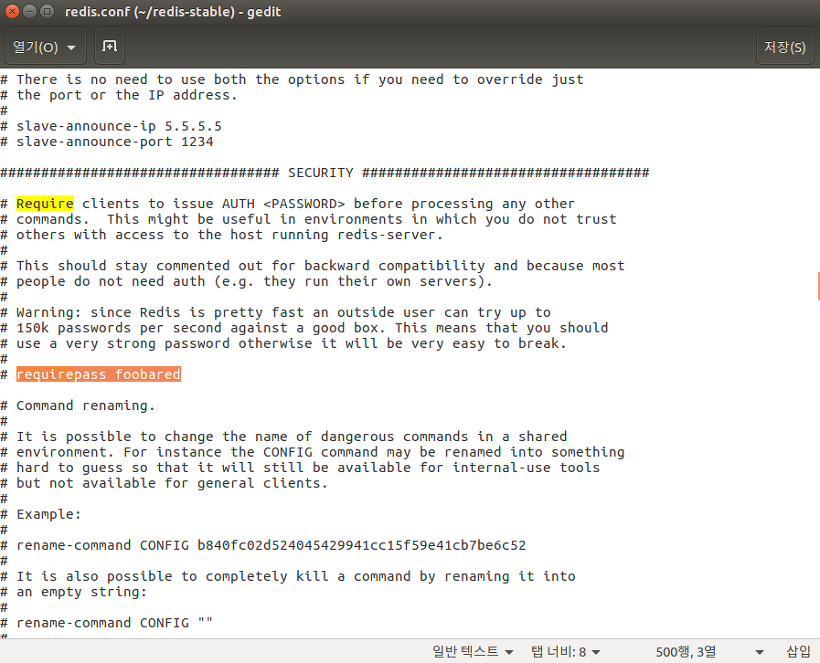

# redis

### 1. redis란?

- Remote Dictionary System의 약자로 쉽게 말하면 "인메모리 원격 캐시 서버" 라 할 수 있다.
- 흔히 사용하면 데이터베이스와 크게 다르지 않아 NoSql DBMS로 분류할 수 있고, 인 메모리라는 특성 때문에 In memory솔루션으로 분류할 수도 있다.
- 초급 개발자 수준에서는 Oracle이나 MySql처럼 redis-server process 를 ip, port에 띄워놓고 접근해서 <key, value>저장하고 가져다 쓰는 정도로 사용 가능하다.
- **메모리를 이용하여 고속으로 <key, value>스타일의 데이터를 저장하고 불러올 수 있는 원격 시스템**

### 2. 특징

- <key, value>쌍으로 데이터를 저장하고 쓰는 것은 파이썬의 Dictionary또는 자바나 자바스크립트 등에서 쓰이는 Map등에서 많이 사용한 방식이다.

- Type : Key타입은 string, value는 숫자나 문자등 바이너리로 저장가능한 모든 것인데 데이터를 가져올 때 쌍따옴표로 감싸지는 것으로 보아 string타입을 리턴하는 것 같다. (**정확하지않는 정보다**)

- Key  : 간견하면서도 중복되지 않아야 한다. 너무 긴 문자열은 피하고 어쩔 수 없다면 해시(SAH1)를 이용하기를 권장한다. 

- Value : lists, sets, hashs와 같이 여러개를 저장 할 수 있는 형식이 있다. 앞서 말한 것처럼 hashs는 하나의 key에 40억개 정도의 값을 저장 할 수 있는데 이렇게 많이 저장하는 것은 안된다.(성능상의 이유로 )

- value format :  value형태는 string, sets, sorted-sets, hashes, lists가 있다.

- 

  - string : 일반적으로 사용하는 단일 값
  - lists : 값들이 여러 개로 들어가는 형태, 배열 앞뒤(왼쪽, 오른쪽)으로 넣고 뺼 수 있음
  - sets : 값들이 여러 개로 들어가는 형태는 똑같으나 값들이 중복될 수 없음, lists는 중복 가능
  - sorted sets : 값들은 sets와 똑같이 들어가고 추가로 score(숫자)를 저장함. score를 기준으로 정렬해서 보여주는 기능이 있음.
  - hashs : 여러 field와 value를 가진 구조로 40억개의 <field, value>쌍을 넣을 수 있음. "key-field-value"

- Expire 설정 : redis에서 사용하는 <key,value>쌍에 만료시간(Expire seconds)을 지정할 수 있다.

  계속해서 데이터를 입력해서는 제한된 메모리가 감당할 수 없기 때문에 반드시 사용해야한다.

  프로그래밍 언어별로 지원하는 라이브러리에서 간단한 코드로 사용이 가능할 것이다.

  expire를 설정하지 않았더라도 메모리가 설정된 값보다 많이 사용하려고 하면 만료 시간이 되지 않았어도 제거한다.

  > 참고로 Redis는 싱글쓰레드로 명령어를 처리하기 때문에 한 번에 하나의 명령어를 처리한다.따라서 cpu, memory를 많이 사용하는 명령어와 구조를 지양해야한다. redis도 계속 메모리에만 있다가 데이터가 사라지는 것이 아니라 디스크에 저장할 수 있는 기능이 있다. (RDB, AOF) 적절히 사용하지 않으면 성능에 문제가 많아지므로 나중에 알아본다. 애초에 실시간 캐시 서버로 이용할 것이라 사용할지는 아직 모르겠음)

  

### 3. redis 설치

- window에서는 공식적으로 설치할 수 없다. 그리고 가상머신에서는 성능의 한계가 있기 때문에 일반 리눅스 서버에서 설치하고 사용하기를 권장한다.

- 리눅스 설치 방법(CentOS, ubuntu등 상관 없다.)

- ```cmd
  wget http://download.redis.io/redis-stable.tar.gz #=> 다운
  tar xvzf redis-stable.tar.gz #=>압축풀기
  cd redis-stable #=> 이동
  make #=> 명령어로 소스코드 컴파일
   
  sudo make install #=> 설치
   
  redis-server #=> 명렁어로 redis서버를 킨다.
  
  
  출처: https://jeong-pro.tistory.com/139 [기본기를 쌓는 정아마추어 코딩블로그]
  ```

- `redis-server` : 레디스 서버
- `redis-cli` : 레디스 CLI 인터페이스
- `redis-sentinel` : 레디스 모니터링 툴
- `redis-benchmark` : 레디스의 성능 테스트를 위한 벤치마킹 툴
- `redis-check-aof` : 데이터 파일 손상 확인

### 4. 간단한 설정변경

- redis가 설치된 redis-stable 디렉토리 안에 "redis.conf"파일이 있다.
- 여기서 설정을 변경 할 수 있다. 

##### 4.1.port

- 기본으로는 6379되어 있다. 변경하고 재실행

##### 4.2.Bind

- redis는 default로 localhost(127.0.0.1)에서만 접근할 수 있도록 되어있다.
- 단순하게 생각해도 내 서버에 아무나 접속해서 set, get을 한다는 것은 이해할 수 없다. 따라서 bind라는 부분에다가 해당 redis에 접근할 수 있는 ip를 적어주면 해당 ip만 redis-server를 이용할 수 있다.
- bind 192.168.0.20 192.168.0.21 208.99.21.64 이런식으로 지정하면 3개의 ip에서만 접근이 가능하다.
- 또한 bind 0.0.0.0 라고 설정하거나 bind부분을 주석처리(#)해버리면 모든 ip에서 접근이 가능하게 된다.
- 보안상 아주 취약하게 되므로 test외에 실제 운영단계에서는 하면 안된다.




##### 4.3.Password(requirepass)

- IP로만 접근에 제한을 두는 것 뿐만 아니라 비밀번호를 설정해서 redis 접속에 제한을 둘 수 있다.
- default로 주석처리되어있어 비밀번호가 필요없다. 만약 비밀번호를 설정하고 싶으면 주석을 풀고 foobared대신 원하는 암호를 적어넣으면 된다.
- 그리고 프로그래밍에서는 해당 redis라이브러리에서 connect하는 부분에 비밀번호를 넣으면 되고, redis-cli를 이용하는 사람은 "auth foobared(비밀번호)"라는 명령어를 입력하고 redis 명령어를 사용하면 된다.


### 5. 사용법

1. set

   - ```ruby
     $redis.set(key, value) #=> 원형
     $redis.set('name' , 'Ben') #=> 실제 사용 코드 
     ```

2. get

   - ```ruby
     $redis.get(key) # => 원형
     $redis.get('name')  #=> 실제 사용 코드
     ```

3. del

   - ```ruby
     $redis.del(key)#=>원형
     $redis.del('name')#=> 실제 사용 코드
     ```


### 6. Redis / Memcached 

1. 