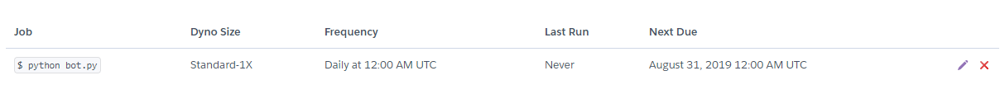

# Github

***


## 기술 면접 가이드 GIthub

- 예비 개발자들 또는 개발자들의 기술 면접 준비를 위한 자료를 정리해놓은 저장소
- https://github.com/JaeYeopHan/Interview_Question_for_Beginner

## 채용 관련가이드

- https://github.com/jojoldu/junior-recruit-scheduler

## 깃허브 정리

### 깃?

- (분산)버전관리 시스템 
- 코드의 history를 관리하는 도구, 개발된 과정과 역사를 볼 수 있고, 특정 시점으로 복구 가능
- **GIt,DVCS(Distributed Version Control System)**

### 깃 생성

```bash
$ git init
#주의 점은 git init 한 후에 

$git status 
# 우리가 쓰고 있는 환경은 CLI(command line interface), 명령을 하기 전까지 지금 상태를 알려주지 않는다.

$touch README.md 
# 빈파일 만들기

$ git add README.md

$git commit -m '백준 1001번 풀이'

$git log (--oneline [은 기록을 짧게 보여주는 것])
# commit 의 기록을 볼 수 있다.
```


```bash
$ git init

# 주의 점은 git init 한 후에 

$git status 

# 우리가 쓰고 있는 환경은 CLI(command line interface), 명령을 하기 전까지 지금 상태를 알려주지 않는다.

$touch README.md 

# 빈파일 만들기

$ git add README.md

$git commit -m '백준 1001번 풀이'

$git log (--oneline [은 기록을 짧게 보여주는 것])

# commit 의 기록을 볼 수 있다.

### 사용자 변경

$ git config --global user.name

$git config --global user.email

# 위 두가지로 검색하면 현재 커밋하는 사용자의 이름을 확인 가능

$git config --global user.name 'edutak'

$git config --global user.email 'edutak.ssafy@gamil.com'
# 위 두가지로 사용자 변경 가능
```


## 리눅스에 깃 저장

- 터미널에서 작성해주자.

```cmd
git init
git clone 주소
```


### 깃허브에 파일 올리기

```bash
 $git remote add origin https://github.com/~ #각자의주소 
 $git remote -v #지금 현재 리모트되고 있는 장소 를 보여준다.
 $git remote add algo https://github.com/~ #리모트 추가장소
 $git remote -v #하면 올리는 장소가 2개가 된다.
 $git remote rm algo #하면 삭제된다.
 $git remote -v #확인해보자.
 
```

### 깃 마크다운

```bash
​```java 하면 java 코드 블럭 생성
> 인용문 주석등 사용
[Git.scm][git-scm.com] 링크 연결 #실제로 가장 많이 쓰이는 마크문법 언어
```

- [Git 입문][https://backlog.com/git-tutorial/kr/]

1. git 저장소 초기화

   ```bash
   $git init
   $git 
   ```

2. add

   ```bash
   $git add .
   $git add REAEME.md
   $git add folder/
   ```

   - add 명령어를 통해 working directory에서 INDEX(staging area)로 특정 파일 이동
   - 커밋을 할 목록을 쌓는 것

3. commit

   ```bash
   $git commit -m'커밋메시지'
   ```

4. 커밋 히스토리 확인하기(log)

   ```bash
   $git log
   $git log -2
   $git log --oneline
   ```

5. 현재 git 상태 알아보기(status)**★★★★★★★★★★**

   ```bash
   $git status
   ```

6. 원격 저장소 활용

   - add, -v , rm

   ```bash
   # remote저장소 등록
   $git remote add origin{github URL}#깃이 아닌 다른 URL일수도있다.
   
   #remote저장소 확인
   $git remote -v
   
   #remote 저장소 삭제
   $git remote rm {저장소 이름}
   
   #저장하면서 커밋하기
   $git commit -am '올라가기'
   ```

   -  push , pull

   ```bash
   #원격 저장소로 (push)
   $giit push origin master
   
   #원격 저장소로부터 가져오기(pull)
   $git pull origin master
   ```

   - Local A, Local B, Github 으로 활동을 하는 경우 원격저장소 이력과 달라져서 충돌 발생 가능성 있음, 항상 작업 시작하기 전 pull을 받과, 작업을 완료한 이후에 push를 진행하면 충돌

     1. auto-merge

        -  동일한 파일을 수정하지 않은 경우 자동으로 merge commit이 발생

        ```
        1. local A에서 작업 후 push
        2. local B에서 작업시 pull을 받지 않음
        3. local B에서 작업 후 commit-> push
        4. 오류 발생(~~ git pull~~)
        5. local B에서 git pull
        6. 자동으로 vim commit 할 수 있도록 뜸.
        7. 저장하면, merge commit 발생
        8. local B에서 git push!
        ```

     2. merge comflict

        - 다른 이력(커밋)으로 동일한 파일이 수정되는 경우  merge comfilict가 발생.
        - 직접 충돌 파일을 해결 해야 한다.

        ```
        1. local A에서 작업 후 push
        2. local B에서 작업시 pull을 받지 않음
        3. local B에서 작업 후 commit-> push
        4. 오류 발생(~~ git pull~~)
        5. local B에서 git pull
        6. 충돌 발생(merge comflict)
        7. 직접 오류 수정 및 add, commit
        8. local B에서 git push
        ```

        - git status 명령어를 통해 어느 파일에서 충돌이 발생하였는지 확인 가능!

7. 되돌리기

   - staging area 에서 unstage

     ```bash
     $git status
     $git reset HEAD b.txt
     ```

   - commit 메시지 수정하기

     ```bash
     $git commit --amend
     ```

     - 커밋메시지를 수정하게 되면 해시값이 변경되어 이력이 변화
     - 따라서 언격 저장소에 push된 이력이라면 절대 변경하면 안된다.
     - 커밋을 하는 과정에서 파일을 빠뜨렸다면, 위의 명령어를 통해서 수정 가능

      ```bash
     $git add omit_file.txt
     $git commit -mend
      ```

8. wording directory 변경사항 버리기

   ```bash
   $git checkout --파일명
   ```

   - 변경사항이 모두 삭제 되고,  해당 파일의 이전 커밋 상태로 변화

## 깃헙 링크 

1. [백준알고리즘][/Text.md] - 상대 경로로 지정한 경우

- 1001 - 출력하기[링크][풀이][.boj/1001]

2. 이미지 삽입시 환경설정의 이미지 삽입의 ./asserts 경로로 이미지 복사를 선택해 주자.
3. http://ndpsoftware.com/git-cheatsheet.html


### gitignore

- [.gitignore][https://www.gitignore.io/]

```bash
.gitignore 
#를 만들고
.settings/
data.csv
*.txt
#이리 작성후 저장하고 실제 저런 류의 파일을 만들며 git bash에서 commit시 무시된다. 즉 올라가 지지않는다.
```

- 사이트에서 관련을 검색해서 만들어서 하면 실제 코딩시 굉장히 도움이 된다. 협력프로젝트시 모든 코드를 공유하는것이 아니기 때문이다.

### 좋은 github commit 약속

- 제목과 본문을 한 줄 띄워 분리하기
- 제목은 영문 기준 50자 이내로
- 제목 첫글자를 대문자로
- 제목 끝에 . 금지
- 제목은 명령조 로
- 본문은 영문 기준 72자마다 줄 바꾸기
- 본문은 어떻게 보다 무엇을 , 왜 에 맞춰 작성하기

### GraphQL?

### 프로젝트 공개 페이지(Github site)

- [github pages](https://pages.github.com/)

- 프로젝트 공개 사이트, HTTP만 있으면 OK

- start bootstrap 검색! resume탬플릿을 [다운](https://startbootstrap.com/themes/resume/) 

- Visual Studio Code 에서 압출푼 파일 전체를 넣어 준다!

  - studio를 열었을 때 템플릿의 모든 코드 파일이 보여야 하며 index.html이 주요 템플릿 파일이다.

- ctrl+shift+p 를 누르고 >default  terminal 을 git bash로 해준다.

- 이를 통해 차차 코드를 바꿔 자신만의 사이트를 만든다.

- Skills 에서 [폰트](https://fontawesome.com/)에서 찾아 올려 주면 된다.

  - 내가 할 수 있는 스킬 로고 바꾸기

- ```bash
  #블로그는 username.github.io 로 이름 지어 주며 주소를 복사하여 넣어준다.
  git remote add http:~ 
  git add .
  git commit -m '블로그 올리기'
  git push origin master # 혹 안된다면 git push -f origin master 해주자. f는 강제 업로드
  ```

  
  


# branch 나누기

web이라는 폴더를 만들고 git bash 를 실행(폴더 안에서 오른쪽 클릭하여 git bash 실행 ), web 폴더 안에서 오른쪽 클릭하여 visual studio code 실행 하여 준비. 

```bash
$git branch{브랜치명}#브랜치 생성
$git checkout{브랜치명}#브랜치 이동
$git branch -d{브랜치명}#브랜치 삭제

$git checkout -b{브랜치명}#브랜치 생성 및 이동

$git merge{브랜치명} #브랜치명을 지금 브랜치로 변경
(master) $git merge feature/index #feature/index 브랜치를 master로 병합
```

```bash
git init 
vi README.md 
touch index.html
git add .
git commit -m 'Add index.html'
```

### 1. 마스터는 내용이 없고 브랜치에 내용이 있는 경우 병합(fast-foward)

1. feature/index branch 생성 및 이동
2. 작업을 한 이후 commit
3. master 이동
4. master에 병합
5. fast_foward(단순히 HEAD를이동)
6. 결과 확인 후 branch 삭제

```bash
#현재 가지 확인
git branch
* master # 로 결과가 나타난다
git branch feature/index
git branch
  feature/index
* master

git checkout feature/index
##student@M50322 MINGW64 ~/Desktop/web (feature/index)
#위처럼 바뀐다~

touch index.css
touch index.js
git add .
git commit -m 'complete index page'

git checkout master
Switched to branch 'master'

git merge feature/index
Updating eec0398..9histor36001f
Fast-forward #커밋후 branch를 나누었는데, 마스터가 일을 한 것이 없기 때문에 그저 branch가 앞으로 이동만 하면 된다.
 index.css | 0
 index.js  | 0
 2 files changed, 0 insertions(+), 0 deletions(-)
 create mode 100644 index.css
 create mode 100644 index.js

git branch -d feature/index #이력을 마스터 branch로 옮겼기 떄문에 이제는 삭제해도 오케이!
Deleted branch feature/index (was 936001f).

```


### 2. 마스터에 내용이 있고  branch 에 내용이 있어 이를 합친 경우(merge commit)

1. feature/signout branch 생성 및 이동
2. 작업을 한 이후 commit
3. master 이동
4. master에 추가 commit 이 발생되어 있고
5. master에 병합
6. merge commit 발생
7. 그래프 확인
8. branch 삭제

```bash
$ git checkout -b feature/singin
Switched to a new branch 'feature/singin'

student@M50322 MINGW64 ~/Desktop/web (master)
$ git checkout feature/singin
Switched to branch 'feature/singin'

student@M50322 MINGW64 ~/Desktop/web (feature/singin)
$ touch Test.html

student@M50322 MINGW64 ~/Desktop/web (feature/singin)
$ git add .

student@M50322 MINGW64 ~/Desktop/web (feature/singin)
$ git commit -m 'branch add'
[feature/singin 65d20e0] branch add
 1 file changed, 0 insertions(+), 0 deletions(-)
 create mode 100644 Test.html

student@M50322 MINGW64 ~/Desktop/web (feature/singin)
$ git checkout master
Switched to branch 'master'

student@M50322 MINGW64 ~/Desktop/web (master)
$ touch MTest.md

student@M50322 MINGW64 ~/Desktop/web (master)
$ git add .

student@M50322 MINGW64 ~/Desktop/web (master)
$ git status
On branch master
Changes to be committed:
  (use "git reset HEAD <file>..." to unstage)

        new file:   MTest.md

student@M50322 MINGW64 ~/Desktop/web (master)
$ git log --oneline
bf1a820 (HEAD -> master) complete
936001f complete index page
eec0398 init index.html

student@M50322 MINGW64 ~/Desktop/web (master)
$ git commit -m 'master add'
[master f79d847] master add
 1 file changed, 0 insertions(+), 0 deletions(-)
 create mode 100644 MTest.md


student@M50322 MINGW64 ~/Desktop/web (master)
$ git log --oneline
f79d847 (HEAD -> master) master add
bf1a820 complete
936001f complete index page
eec0398 init index.html


student@M50322 MINGW64 ~/Desktop/web (master)
$ git merge feature/singin
Merge made by the 'recursive' strategy.
 Test.html | 0
 1 file changed, 0 insertions(+), 0 deletions(-)
 create mode 100644 Test.html


student@M50322 MINGW64 ~/Desktop/web (master)
$ git log --oneline
bf4a7b1 (HEAD -> master) Merge branch 'feature/singin'
f79d847 master add
65d20e0 (feature/singin) branch add
bf1a820 complete
936001f complete index page
eec0398 init index.html


student@M50322 MINGW64 ~/Desktop/web (master)
$ git log --oneline --graph
*   bf4a7b1 (HEAD -> master) Merge branch 'feature/singin'
|\
| * 65d20e0 (feature/singin) branch add
* | f79d847 master add
|/
* bf1a820 complete
* 936001f complete index page
* eec0398 init index.html
#branch 된 것을 확인하는 것은 --graph로 하면 시각적으로 확인 가능

student@M50322 MINGW64 ~/Desktop/web (master)
$ git branch -d feature/singin
Deleted branch feature/singin (was 65d20e0).
# 마지막으로 삭제~ 필요없음으로
```

### 3. mergit commit 이 충돌되는 경우

```bash
student@M50322 MINGW64 ~/Desktop/web (master)
$ git status
On branch master
nothing to commit, working tree clean

student@M50322 MINGW64 ~/Desktop/web (master)
$ git checkout -b test3
Switched to branch 'test3'

student@M50322 MINGW64 ~/Desktop/web (test3)
$ touch test.txt

student@M50322 MINGW64 ~/Desktop/web (test3)
$ vi test.txt

student@M50322 MINGW64 ~/Desktop/web (test3)
$ git add .
warning: LF will be replaced by CRLF in test.txt.
The file will have its original line endings in your working directory

student@M50322 MINGW64 ~/Desktop/web (test3)
$ git commit -m 'test3에 파일 추가 및 내용 작성'
[test3 6293268] test3에 파일 추가 및 내용 작성
 1 file changed, 1 insertion(+)
 create mode 100644 test.txt

student@M50322 MINGW64 ~/Desktop/web (test3)
$ git checkout master
Switched to branch 'master'

student@M50322 MINGW64 ~/Desktop/web (master)
$ git ststus
git: 'ststus' is not a git command. See 'git --help'.

The most similar command is
        status

student@M50322 MINGW64 ~/Desktop/web (master)
$ git status
On branch master
nothing to commit, working tree clean

student@M50322 MINGW64 ~/Desktop/web (master)
$ touch test.txt

student@M50322 MINGW64 ~/Desktop/web (master)
$ vi test.txt

student@M50322 MINGW64 ~/Desktop/web (master)
$ git add .
warning: LF will be replaced by CRLF in test.txt.
The file will have its original line endings in your working directory

student@M50322 MINGW64 ~/Desktop/web (master)
$ git commit -m '마스터에 파일 추가 및 내용 작성'
[master 690681d] 마스터에 파일 추가 및 내용 작성
 1 file changed, 1 insertion(+)
 create mode 100644 test.txt

student@M50322 MINGW64 ~/Desktop/web (master)
$ git merge test3
CONFLICT (add/add): Merge conflict in test.txt
Auto-merging test.txt
Automatic merge failed; fix conflicts and then commit the result.

student@M50322 MINGW64 ~/Desktop/web (master|MERGING)
$ vi test.txt

student@M50322 MINGW64 ~/Desktop/web (master|MERGING)
$ git add .

student@M50322 MINGW64 ~/Desktop/web (master|MERGING)
$ git commit -m '그냥 합쳤다'
[master 85c4689] 그냥 합쳤다

student@M50322 MINGW64 ~/Desktop/web (master)
$ vi test.txt

student@M50322 MINGW64 ~/Desktop/web (master)
$ git log --oneline --graph
*   85c4689 (HEAD -> master) 그냥 합쳤다
|\
| * 6293268 (test3) test3에 파일 추가 및 내용 작성
* | 690681d 마스터에 파일 추가 및 내용 작성
* | 38c15f3 clear;
|/
* c676c03 master add
*   57d3926 Merge branch 'feature/signut'
|\
| * 42807e2 branch add
* | 91ae6a1 master add
|/
* 254e5b4 branch add
*   bf4a7b1 Merge branch 'feature/singin'
|\
| * 65d20e0 branch add
* | f79d847 master add
|/
* bf1a820 complete
* 936001f complete index page
* eec0398 init index.html

```


### stash-임시 공간

> 작업 중에 작업이 완료 되지 않아서 커밋을  허가 야먀헌 상황일 경우 임시적으로 현재의 변경사항을 저장할 수 있는 공간

```bash
git stash

git pop
git 
```


### 돌아가기

1. `$ git reset (--hard) {커밋해시코드}`
   - log다 사라지고 그 시점으로 돌아가는 것 정말 돌아가는것(기존의 이력을 삭제)
2. `$ git revert {커밋해시코드}`
   - 기존의 이력을 삭제하지 않고 돌아가는 것만 표현!!! 
3. `$ git reflog `
   - 돌아가서 과거 이력을 보는것으로 삭제한 branch로도 다시 갈 수 있다.

# python 설치

[링크](https://www.python.org/downloads/windows/)  에서 Windows x86-64 executable installer 다운!

- 주의점은 설치시 path를 설정 체크를 해준 후에 설치 하자(자동 환경변수 설정)

새 폴더를 만들고 오른쪽 버튼을 눌러 visual studio code 실행

새 터미널에 

```bash
python -V
#설치 확인
```


### Hello

```python
print('happy hacking!')

name = '현선'
print(name)
name=123
print(name)
name =True
print(name)
#리스트
my_list=['히야',123,True,'ㅎㅇㅎㅇ']
type(my_list)
#딕셔너리(해시)
hihi = {'g': 10,'a': 20}
print(hihi['g'])

#조건
a=5
if a>3:
    print('a')
else:
    print('b')

#반복
a=[1,3,5,6]
for num in a:
    print(num)

name='홍길동'
for char in name:
    print(char)
# 객체란? 객관적인 형태로 만드는 것 ,things
a=[6,4,1]
a.sort()
print(a)
```

```bash
student@M50322 MINGW64 ~/Desktop/phthon
$ python hello.py
현선
123
True
10
a
1
3
5
6
홍
길
동
[1, 4, 6]
#참고로 중간에 에러가 뜨면 나머지 결과는 뜨지않는다.
```

```cmd
student@M50322 MINGW64 ~/Desktop/phthon
$ python -i
Python 3.7.4 (tags/v3.7.4:e09359112e, Jul  8 2019, 20:34:20) [MSC v.1916 64 bit (AMD64)] on win32
Type "help", "copyright", "credits" or "license" for more information.
>>> #다양하게 작성해 보장
```


- api.py 뉴파일 생성
- api는? 프로그래밍 언어가 제공하는 기능을 제어할 수 있게 만든 *인터페이스*

[빗썸 api](https://apidocs.bithumb.com/docs/ticker)

```bash
student@M50322 MINGW64 ~/Desktop/phthon
$ pip install requests
```

```python
# 1. requests 라이브러리 가져오기
import requests
# 2. rul 요청보내서
url= 'https://api.bithumb.com/public/ticker/btc'
#3. 값을 받아 온다.
response= requests.get(url).json() #.json()  안하면 값으로 하면 json으로 나온다.
print(response['data']['max_price'])
```

- 브라우저에 저 url를 넣으면 json()값이 나온다.

### 개발 branch

[git flow](http://woowabros.github.io/experience/2017/10/30/baemin-mobile-git-branch-strategy.html)

[github flow](https://ujuc.github.io/2015/12/16/git-flow-github-flow-gitlab-flow/)

- 두개의 차이점을 확인하자.
- branch를 하나 만들고 거기에 파일 작성 후 push를 하자.
- github에서 확인하면 branch로 엮여 있고  이를 확인후 merge를 하면 master에 합쳐진다.

### forking

오픈 소스에서 포크를 해서 나의 repository에 저장한 후 이래저래 소스 변경 가능(본 내용을 건들일 수 없기 때문에)

### chrome 확장 프로그램

1. Wappalyzer
2. adblock
3. json viewer

### API 

#### HTTP

```bash
# 1. requests 라이브러리 가져오기
import requests
# 2. rul 요청보내서
url= 'https://api.bithumb.com/public/ticker/btc'
#3. 값을 받아 온다.
response= requests.get(url).json() #.json()  안하면 값으로 하면 json으로 나온다.
print(response['data']['max_price'])
```

#### 번역하기

- [참고,github decouple](https://github.com/henriquebastos/python-decouple)

1. 텔레그램 설치
2. 네이버 developer에 로그인 해놓자.
3. 새로운 chtbot 만들고 visual studio code 실행

```bash

student@M50322 MINGW64 ~/Desktop/chtbot
$ git init
Initialized empty Git repository in C:/Users/student/Desktop/chtbot/.git/

student@M50322 MINGW64 ~/Desktop/chtbot (master)
$ pip install python-decouple
Collecting python-decouple
  Downloading https://files.pythonhosted.org/packages/9b/99//python-decouple-3.1.tar.gz
Installing collected packages: python-decouple
  Running setup.py install for python-decouple ... done
Successfully installed python-decouple-3.1
You are using pip version 19.0.3, however version 19.2.3 is available.
You should consider upgrading via the 'python -m pip install --upgrade pip' command.

student@M50322 MINGW64 ~/Desktop/chtbot (master)
$ touch .env

student@M50322 MINGW64 ~/Desktop/chtbot (master)
$ touch .gitignore
```


.env

```cmd
naver_CLIENT_ID="키 아이디"
naver_CLIENT_PWD="키 비밀번호"
```

papago.py

```python
import requests
from decouple import config

#1. 환경변수 설정
naver_client_id=config('naver_CLIENT_ID')
naver_client_secret=config('naver_CLIENT_PWD')
print(naver_client_id)

#. 2.url설정

url='https://openapi.naver.com/v1/papago/n2mt'
#3. 헤더 및 data설정
headers={
    'X-Naver-Client-Id':naver_client_id,
    'X-Naver-client-Secret':naver_client_secret

}
data={
    'source': 'ko',
    'target': 'en',
    'text':'댕댕이'
}
# 4. 요청
#url에 헤더와 데이터를 포함해서 Post요청을 보내고
#그 결과를 (json)을 파싱
response=requests.post(url,headers=headers,data=data).json()
import pprint
pprint.pprint(response['message']['result']['translatedText'])
```


#### chtbot

1. 텔레그램에서  @botfather 에서 나의 아이디를 만들자
2. 만들게 되면 아이디와 나의 챗봇이 생성된다.

```bash
https://api.telegram.org/bot나의토큰?을입력/getMe
https://api.telegram.org/bot나의토큰?을입력/getUpdate # 글을 쓰면 그 내용을 볼 수 있다.
https://api.telegram.org/bot나의토큰?을입력/sendMessage?chat_id=getUpdate에 쓰여진 id&text=안녕 #이렇게되면 챗봇이 그 아이디로 답장을 하게 된다 안녕이라고

```

.env

```bash
naver_CLIENT_ID=""
naver_CLIENT_PWD=""
TELEGRAM=""
```

bot.py

```python
import requests
from decouple import config

# 1. 토큰 값 설정
token=config('TELEGRAM')
# 3. url 설정
#  char_id, text 요청변수 설정!
#string interpolation 문자열 내에 변수 값 삽입(f-string)
base_url=f'https://api.telegram.org/bot{token}'
chat_id=
text='안녕'
url=f'{base_url}/sendMessage?chat_id={chat_id}&text={text}'
# 3. 메시지 보내기
requests.get(url)


```


#### 주 금요일에 나에게 날아오는 로또!

```python
import random
numbers=range(1,46) #1 이상 46미만
# print(list(numbers))
lotto=random.sample(numbers,6)
print(lotto)

# for i in range(5):
#     print('hi')
```

아래에 추가후 text를 

```python
import requests
import random

from decouple import config
# 0.로또 번호 추출
numbers=range(1,46) #1 이상 46미만
text=sorted(random.sample(numbers,6))
# 1. 토큰 값 설정
token=config('TELEGRAM')
# 3. url 설정
#  char_id, text 요청변수 설정!
#string interpolation 문자열 내에 변수 값 삽입(f-string)
base_url=f'https://api.telegram.org/bot{token}'
chat_id=
url=f'{base_url}/sendMessage?chat_id={chat_id}&text={text}'
# 3. 메시지 보내기
requests.get(url)


```


#### heroku

heroku cli 을 구글에 검색하여 들어가서 다운로드 받자 windows-64로

새파일 생성하고 이름을 Procfile(확장자 없이) 하면 보라색으로 생성

runtime.txt 새파일 만들고

```
python-3.7.2
```

입력 후 저장

```bash
student@M50322 MINGW64 ~/Desktop/chtbot (master)
$ pip freeze > requirements.txt

student@M50322 MINGW64 ~/Desktop/chtbot (master)
$ git add .

student@M50322 MINGW64 ~/Desktop/chtbot (master)
$ git commit m 'heroku setting'
error: pathspec 'm' did not match any file(s) known to git
error: pathspec 'heroku setting' did not match any file(s) known to git

student@M50322 MINGW64 ~/Desktop/chtbot (master)
$ git commit -m 'heroku setting'
[master 7da6b60] heroku setting
 3 files changed, 16 insertions(+)
 create mode 100644 Procfile
 create mode 100644 requirements.txt
 create mode 100644 runtime.txt
```

git bash를 켜서 (visual studio code 에서는 안되니)

```bash
student@M50322 MINGW64 ~
$ herodu login
bash: herodu: command not found

student@M50322 MINGW64 ~
$ heroku login
heroku: Press any key to open up the browser to login or q to exit:
Opening browser to https:
heroku: Waiting for login...
Logging in... done
#나의 아이디 확인
^C▒ϰ▒ ▒۾▒▒▒ ▒▒▒▒▒ðڽ▒▒ϱ▒ (Y/N)? y
y

```

chtbot에서 오른쪽 버튼 누르고 git bash 실행 후

```bash
student@M50322 MINGW64 ~/Desktop/chtbot (master)
$ heroku create chtbot-openapi
Creating chtbot-openapi... done
https://chtbot-openapi.herokuapp.com/ | https://git.heroku.com/chtbot-openapi.git

student@M50322 MINGW64 ~/Desktop/chtbot (master)
$ git push heroku master

```

- heroku 를 create하면 push가 된다!
- [heroku app에 들어간다](https://dashboard.heroku.com/apps)
- 연결해 놓은 이른 chtbot-openapo(이름을 위에 정해놓은 것) 을 클릭!
- Configure Add-ons을 클릭 하고 Heroku Scheduler 를 무료로 사용!
- 스켈쥴러를 클릭하여 시간을 지정!



- study를 참고!
- 