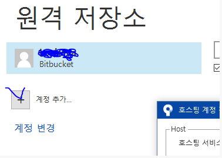
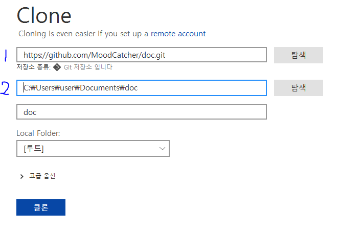
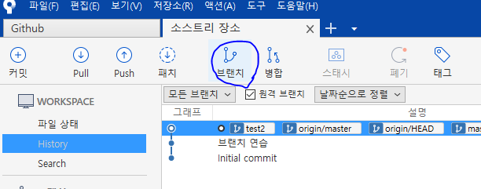
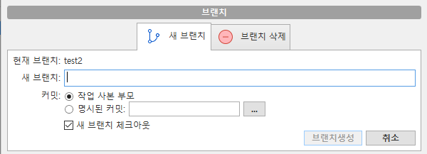

# SourceTree

1.  SourceTree 설치 [위치는 이곳]( https://www.sourcetreeapp.com/ )
2. 
3. 를 클릭하여 자신의 github과 연동을 시킨다!

## clone

1. 
2. 1번 위치에는 자신의 깃헙 주소를 복사해서 붙여넣기!
3. 2번 위치에는 저장할 위치 작성!
4. 클론을 해준다.

## 브랜치 생성

1. 
2. 클릭후
3. 
4. 이름을 작성해서 만들어 준다.

